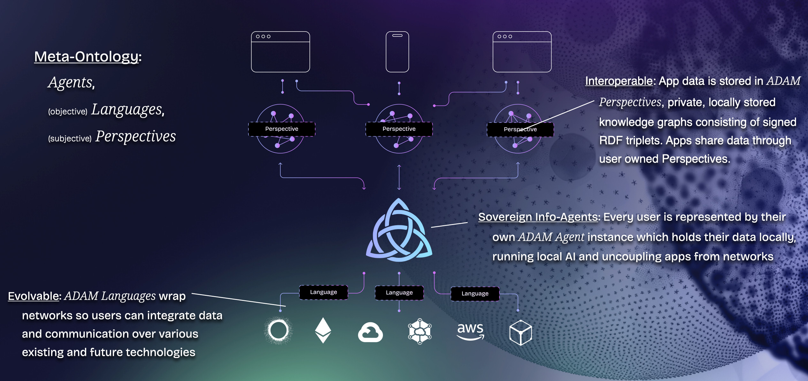

[](http://coasys.org/)
[](http://docs.ad4m.dev/)
[](https://github.com/holochain/cryptographic-autonomy-license)
[](https://github.com/coasys/ad4m/actions/workflows/publish.yml)
[](https://discord.com/invite/fYGVM66jEz)
[](https://x.com/ad4m_layer)

# AD4M: Agent-Centric Distributed Application Meta-ontology

<div align="center">
  
</div>

> **🤖 AI Agent Developers:** AD4M includes a built-in [MCP server](https://modelcontextprotocol.io/) and an [OpenClaw plugin](plugins/ad4m/) that gives AI agents persistent identity, distributed memory, and P2P collaboration — out of the box. See the [MCP Server section](#mcp-server-ai-agent-integration) below.

## Vision

AD4M is a spanning layer that extends the internet stack to enable true collective intelligence in a fully distributed way. Just as TCP/IP created a universal protocol for machines to communicate, AD4M creates a universal protocol for agents — both human and AI — to make meaning together.

**"Agent-centric" means exactly what it says:** every agent, whether a person or an AI, runs its own sovereign node and participates as a first-class peer in the network. There is no central server deciding who gets to connect or what protocols they must use. This makes AD4M the natural peer-to-peer infrastructure for AI agents that need persistent identity, shared memory, and real-time collaboration with humans and each other — all without platform lock-in.

**Collective intelligence emerges from many small agents — human and AI — connecting and collaborating through AD4M.** Each agent is autonomous, but together they form larger wholes: groups, communities, organizations, networks. This holonic structure — where every part is simultaneously a whole in its own right and a component of something bigger — is fundamental to how AD4M works. AD4M is the substrate, the holonic meta-layer where real collective intelligence can grow organically, without central coordination.

This new layer is needed because:
- The current web is fragmented into data silos and walled gardens
- We lack a universal way to connect meaning across platforms and protocols
- AI agents need sovereign infrastructure — not API keys to someone else's server
- Collective intelligence requires both sovereignty and interoperability
- The future of collaboration is humans and AI agents working together as peers

AD4M solves these challenges by:
- Creating a semantic overlay across all existing protocols
- Enabling any storage or communication method through pluggable Languages
- Treating all data as agent-authored expressions with verifiable provenance
- Building meaning through shared perspectives and social DNA
- Giving AI agents the same first-class status as human agents in a P2P network
- Providing a super-evolvable foundation — new protocols and patterns can be added without breaking existing ones

Think of AD4M as the missing piece in the internet stack – one that transcends mere data exchange to enable meaningful collaboration between sovereign agents (human and AI alike), regardless of the underlying protocols or platforms they use.

## Architecture & Execution Strategy

AD4M represents a sophisticated agent-centric node – a "second brain" that runs on the user's machine. Unlike traditional web applications that rely on central servers, AD4M puts powerful server capabilities directly in the hands of users:

### Local-First Sovereign Node

Each AD4M instance is a full-featured data node that:
- Runs entirely on the user's machine
- Maintains the agent's digital identity and keys
- Stores and manages their semantic data
- Connects to other agents through various protocols
- Acts as their sovereign compute environment

### Technical Sophistication

AD4M integrates several powerful technologies into a cohesive whole:
- [Holochain](https://github.com/holochain/holochain): For distributed hash tables and p2p networking
- [Deno & V8](https://github.com/denoland/deno): For secure JavaScript/TypeScript execution
- [SurrealDB](https://github.com/surrealdb/surrealdb): For local graph-relational data persistence and live queries
- [Scryer-Prolog](https://github.com/mthom/scryer-prolog): For semantic reasoning and queries
- [Juniper](https://github.com/graphql-rust/juniper): For GraphQL API capabilities
- [Kalosm](https://github.com/floneum/floneum): For AI model inference with Candle

This complexity is necessary to provide a rich, sovereign computing environment – but it's all packaged to run smoothly on personal devices.

### Self-Recursive Bootstrap

AD4M achieves extensibility through a clever self-recursive design:
1. The three core concepts (Agents, Languages, Perspectives) are themselves implemented as Languages
2. This means the very foundations of AD4M can be extended and evolved
3. New implementations of these core Languages can be created and adopted
4. The system becomes an evolvable, living network

This architectural pattern enables AD4M to grow into a true "global brain" – a distributed intelligence layer that can adapt and evolve without central coordination.

## Key Concepts

### 1. Languages: Universal Protocol Adapters

Languages in AD4M are pluggable protocols that define how information is stored and shared. They create a spanning layer across all existing web protocols and storage systems:

```typescript
// Languages can wrap any protocol or storage system
const ipfsLanguage = "QmIPFSHash";   // Store on IPFS
const solidLanguage = "QmSolidHash"; // Store on Solid pods
const webLanguage = "https";         // Regular web URLs

// Create and share data through any Language
const expression = await ad4m.expression.create(
  { text: "Hello World!" },
  ipfsLanguage
);
// Returns: QmIPFSHash://unique-address
```

### 2. Expressions: Agent-Authored Data

Every piece of data in AD4M is an Expression – a cryptographically signed statement by an agent. This creates a web of verifiable claims rather than "objective" data:

```typescript
// Expressions are always signed by their author
const expression = await ad4m.expression.get("QmHash123://post789");
console.log(expression);
/* {
  author: "did:key:z6Mk...",     // Who made this claim
  timestamp: "2026-03-20...",    // When it was made
  data: { text: "Hello!" },      // The actual content
  proof: {                       // Cryptographic proof
    signature: "...",
    valid: true
  }
} */
```

### 3. Perspectives: Semantic Meaning-Making

Perspectives are agent-centric semantic graphs that give meaning to Expressions through links. They enable:
- Personal and shared views of information
- Semantic relationships between any pieces of data
- Collaborative meaning-making in shared spaces

```typescript
// Create semantic relationships between any expressions
await perspective.add({
  source: "did:key:alice",              // Subject
  predicate: "foaf://knows",            // Relationship type
  target: "did:key:bob"                 // Object
});

// Query based on meaning
const friends = await perspective.get({
  predicate: "foaf://knows"             // Find all friendship links
});
```

### 4. Social DNA: Collective Intelligence Patterns

Social DNA defines interaction patterns and social contracts that can be shared and reused across applications. It includes:
- **Models** (`Ad4mModel`): Define semantic object types with typed properties and relations
- **Flows**: Define possible state transitions
- **Collections**: Define relationship patterns
- Shared semantics for social applications

```typescript
import { Ad4mModel, Model, Property, Optional, HasMany } from "@coasys/ad4m";

// Define a reusable social pattern
@Model({ name: "Post" })
class Post extends Ad4mModel {
  @Property({
    through: "social://content",
    resolveLanguage: "literal"
  })
  content: string = "";

  @Optional({
    through: "social://status",
    initial: "social://draft"
  })
  status: string = "";

  @HasMany({ through: "social://comments" })
  comments: string[] = [];
}

// Create and save an instance
const post = new Post(perspective);
post.content = "Hello World!";
await post.save();

// Query posts with filters
const published = await Post.query(perspective)
  .where({ status: "social://published" })
  .run();
```

These concepts work together to create a new kind of internet – one where meaning flows freely between sovereign agents while maintaining cryptographic verifiability and semantic richness.

## Getting Started

### Prerequisites

#### Core Dependencies
- **Rust** (1.92 or later)
  ```bash
  rustup install 1.92
  rustup default 1.92
  rustup target add wasm32-unknown-unknown
  ```
- **Go** (1.24 or later)
  ```bash
  # Follow instructions at https://go.dev/doc/install
  ```
- **Node.js** (24+ recommended) and **pnpm**
  ```bash
  npm install -g pnpm
  ```

#### Platform-Specific Dependencies

**macOS**:
```bash
brew install protobuf cmake
```

**Linux (Ubuntu/Debian)**:
```bash
sudo apt-get update
sudo apt-get install -y \
  libgtk-3-dev webkit2gtk-4.0 libappindicator3-dev \
  librsvg2-dev patchelf protobuf-compiler cmake \
  fuse libfuse2 mesa-utils mesa-vulkan-drivers \
  libsoup-3.0-dev javascriptcoregtk-4.1-dev \
  webkit2gtk-4.1-dev librust-alsa-sys-dev
```

**Windows**:
```bash
choco install strawberryperl protoc cmake curl cygwin gnuwin32-m4 msys2 make mingw
```

### Installation

1. Clone the repository:
```bash
git clone https://github.com/coasys/ad4m.git
cd ad4m
```

2. Install dependencies:
```bash
pnpm install
```

3. Build all packages:
```bash
pnpm run build
```

4. Create a UI bundle for the AD4M Launcher:
```bash
pnpm run package-ad4m
```

Find the launcher bundle in `target/release/bundle`.

## Project Structure

```
ad4m/
├── core/                   # Core AD4M types, Ad4mModel, and TypeScript client (@coasys/ad4m)
├── rust-executor/         # Rust executor: GraphQL server, Deno runtime, Holochain, AI, Prolog
├── rust-client/          # Rust client library (ad4m-client on crates.io)
├── executor/             # JavaScript executor: agent state, perspectives, languages, expressions
├── bootstrap-languages/  # Core Languages required for AD4M to function
├── cli/                 # Command line tools (ad4m on crates.io)
├── connect/            # Library for connecting apps to AD4M with capability management
├── dapp/              # DApp server for blockchain integration
├── ui/               # Tauri-based system tray application (AD4M Launcher)
├── docs-src/        # Documentation source (VitePress)
├── tests/           # Integration tests
└── test-runner/    # Test automation framework
```

## Documentation
- [Intro and Vision](https://docs.ad4m.dev/)
- [Core Concepts](https://docs.ad4m.dev/concepts)
- [Developer Guides](https://docs.ad4m.dev/developer-guides)
- [API Reference](https://docs.ad4m.dev/jsdoc)
- [Contributing Guide](CONTRIBUTING.md)

## Tools & Integrations

### AD4M CLI

The `ad4m` command line tool provides direct access to AD4M functionality:

```bash
# Install from crates.io
cargo install ad4m

# Or build locally
cd cli && cargo build --release
```

Basic usage:
```bash
# Initialize AD4M
ad4m-executor init

# Start the executor
ad4m-executor run

# Create a perspective
ad4m perspectives create

# Query links
ad4m perspectives query-links <uuid>

# Publish a neighbourhood
ad4m neighbourhood publish <perspective-uuid>
```

### AD4M Launcher

For a graphical interface, install the [AD4M Launcher](https://github.com/coasys/ad4m-launcher) – a system tray application for managing AD4M executors.

### MCP Server (AI Agent Integration)

AD4M includes a built-in [MCP](https://modelcontextprotocol.io/) (Model Context Protocol) server that enables AI agents to interact with AD4M directly. Social DNA models (SHACL subject classes) are automatically mapped to MCP tools — define a `Channel` model once, and AI agents get `channel_create`, `channel_get`, `channel_set_name`, etc. out of the box.

This powers integrations like the [OpenClaw AD4M Plugin](https://github.com/openclaw/openclaw), which gives AI agents persistent distributed memory and P2P collaboration capabilities.

## Testing

```bash
# Run JS integration tests
pnpm test

# Run Rust tests (--test-threads=1 required: shared state)
cd rust-executor && cargo test --release -- --test-threads=1

# Run specific language tests
cd bootstrap-languages/<language> && pnpm test
```

## Contributing

We welcome contributions! Please see our [Contributing Guide](CONTRIBUTING.md) for details.

### Development Process

1. Fork the repository
2. Create a feature branch from `dev`
3. Make your changes
4. Run tests
5. Submit a pull request to `dev` branch

## Community

[](https://discord.com/invite/fYGVM66jEz)
[](https://x.com/ad4m_layer)
[](https://medium.com/coasys)

## Ecosystem

AD4M is part of a growing ecosystem:
- **[Flux](https://github.com/coasys/flux)** — Decentralized social network built on AD4M
- **[We](https://github.com/coasys/we)** — Collaborative workspace application
- **[OpenClaw](https://github.com/openclaw/openclaw)** — AI agent framework with AD4M integration
- **[AD4M Launcher](https://github.com/coasys/ad4m-launcher)** — Desktop application for managing AD4M

## License

AD4M is licensed under the [Cryptographic Autonomy License 1.0](LICENSE).

This license ensures:
- The right to run the software
- Access to source code
- The right to modify and distribute
- Protection of user autonomy and data sovereignty

## Acknowledgments

AD4M is developed by [Coasys](https://coasys.org) and builds upon ideas from:
- The Semantic Web (Tim Berners-Lee)
- Agent-centric computing (Arthur Brock)
- Holochain distributed architecture
- Solid personal data stores
- Decentralized identity (DIDs & VCs)

---

**Built with ❤️ by the Coasys team and contributors worldwide.**
