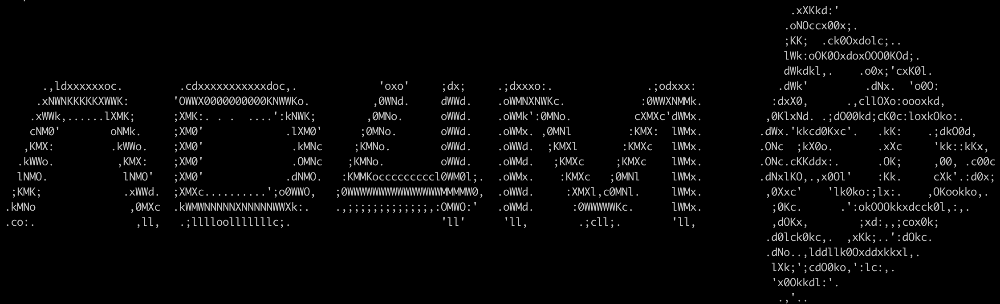
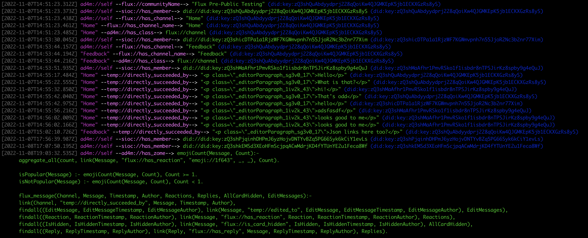
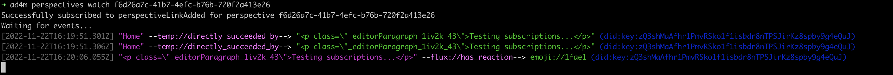

# AD4M Command Line Tools



## Overview

The AD4M (Agent-Centric Distributed Application Meta-ontology) Command Line Tools provide powerful interfaces for interacting with the AD4M ecosystem. These tools enable developers to:

- Control and manage AD4M agents
- Create and manage perspectives (semantic data spaces)
- Work with languages (pluggable protocols)
- Build and join neighborhoods (shared spaces)
- Manage runtime configurations
- Debug and develop AD4M applications

The package includes two main executables:
- `ad4m`: A client for interacting with the AD4M executor
- `ad4m-executor`: The core executor that runs your AD4M agent

## Installation

### Prerequisites

#### Rust Version
Make sure you have `rustup` installed (follow instructions [here](https://www.rust-lang.org/tools/install)).
AD4M requires Rust version 1.84.0 or later. Install it using:
```bash
rustup install 1.84.0
rustup default 1.84.0
```

#### Rust WASM Target
For building Holochain DNAs (required for AD4M bootstrap languages), install the WASM target:
```bash
rustup target add wasm32-unknown-unknown
```

#### Go
AD4M depends on [Go](https://go.dev) version 1.22.0 or later.
Follow the installation instructions at [https://go.dev/doc/install](https://go.dev/doc/install).

Verify your Go installation:
```bash
go version  # Should show 1.22.0 or later
```

#### Platform-Specific Dependencies

##### macOS
Using [Homebrew](https://brew.sh/):
```bash
brew install protobuf cmake
```

##### Linux (Ubuntu / Debian)
```bash
sudo apt-get update
sudo apt-get install -y libgtk-3-dev webkit2gtk-4.0 libappindicator3-dev librsvg2-dev patchelf protobuf-compiler cmake fuse libfuse2 mesa-utils mesa-vulkan-drivers libsoup-3.0-dev javascriptcoregtk-4.1-dev webkit2gtk-4.1-dev librust-alsa-sys-dev
```

##### Windows
Using [Chocolatey](https://chocolatey.org/):
```bash
choco install strawberryperl protoc cmake curl cygwin gnuwin32-m4 msys2 make mingw
```

### Installing AD4M

Install the AD4M tools using Cargo:
```bash
cargo install ad4m
```

## Getting Started

1. Initialize the AD4M executor:
```bash
ad4m-executor init
```

2. Run the executor:
```bash
ad4m-executor run
```

## Core Commands

### Agent Management
```bash
# Generate a new agent
ad4m agent generate

# Unlock your agent
ad4m agent unlock

# View agent status
ad4m agent status

# View your agent info
ad4m agent me

# Lock your agent
ad4m agent lock

# Watch agent status changes
ad4m agent watch
```

### Perspectives
```bash
# List all perspectives
ad4m perspectives

# Query links in a perspective
ad4m perspectives query-links <perspective-UUID>

# Watch perspective changes in real-time
ad4m perspectives watch <perspective-UUID>

# Create a new perspective
ad4m perspectives create

# Add links to a perspective
ad4m perspectives add-link <perspective-UUID> <source> <predicate> <target>
```

### Languages
```bash
# List all installed languages
ad4m languages all

# Get info about a specific language
ad4m languages by-address <language-address>

# Publish a new language
ad4m languages publish <path> --name <name> --description <desc>

# Apply template and publish
ad4m languages apply-template-and-publish <source> <template-data>

# Remove a language
ad4m languages remove <address>
```

### Neighborhoods
```bash
# Create a new neighborhood
ad4m neighbourhoods create <perspective-UUID> <link-language>

# Join an existing neighborhood
ad4m neighbourhoods join <url>
```

### Runtime Management
```bash
# View runtime info
ad4m runtime info

# Manage trusted agents
ad4m runtime add-trusted-agents <agents...>
ad4m runtime delete-trusted-agents <agents...>
ad4m runtime trusted-agents

# Manage friends
ad4m runtime add-friends <agents...>
ad4m runtime remove-friends <agents...>
ad4m runtime friends

# View executor logs
ad4m log
```

### Expression Management
```bash
# Create a new expression
ad4m expression create <language-address> <content>

# Get expression details
ad4m expression get <url>

# Get raw expression data
ad4m expression get-raw <url>
```

## Interactive REPL

AD4M provides an interactive REPL (Read-Eval-Print Loop) for working with perspectives. The REPL supports both Prolog-style queries and direct commands for managing subjects and links.

To enter the REPL for a perspective:
```bash
ad4m perspectives repl <perspective-UUID>
```

### REPL Commands

#### Link Management
```
# Add a new link (status is required)
add_link(<source>, <predicate>, <status>, <target>)
# Use _ for any parameter to make it optional

# Get links with optional parameters
get_links(<source>, <predicate>, <target>)
# Call get_links() with no parameters to get all links

# Show all links (same as get_links())
all-links

#### Subject Management
```
# Create a new subject
new <class>(<base>)

# Set a property on a subject
subject(<base>)[<property>] = <value>

# Add a value to a collection property
subject(<base>)[<collection>] <= <value>

# View subject details
subject(<base>)
```

#### Class Management
```
# List all subject classes
classes

# Show DNA/schema of a class
sdna <class>

# Show SDNA authorship information (debugging)
sdna-authors
```

#### System Commands
```
# Show help
help

# Clear the screen
clear

# Show version information
version

# Exit the REPL
exit
```

#### Prolog Queries
The REPL also functions as a Prolog shell where you can run any valid Prolog query against the perspective's knowledge base.

Example queries:
```prolog
# Find all subjects of a class
subject(X, 'Person')

# Find properties of subjects
hasProperty(Subject, 'name', Name)

# Complex relationship queries
friend(X, Y), hobby(Y, 'coding')
```

## Advanced Usage

### Development Commands
```bash
# Generate bootstrap seed
ad4m dev generate-bootstrap <agent-path> <passphrase> <seed-proto>

# Test expression language
ad4m dev publish-and-test-expression-language <language-path> <data>
```

For a complete list of commands and their options:
```bash
ad4m --help
```

## Contributing

Contributions to AD4M are welcome! Please read our contributing guidelines and submit pull requests to our repository.

## License

AD4M is licensed under the [CAL-1.0](LICENSE).

## More Information

For more information about AD4M:
- Visit our [official website](https://coasys.org/adam)
- Read the [core documentation](https://docs.ad4m.dev)
- Join our [community](https://discord.com/invite/fYGVM66jEz)

## Screenshots




