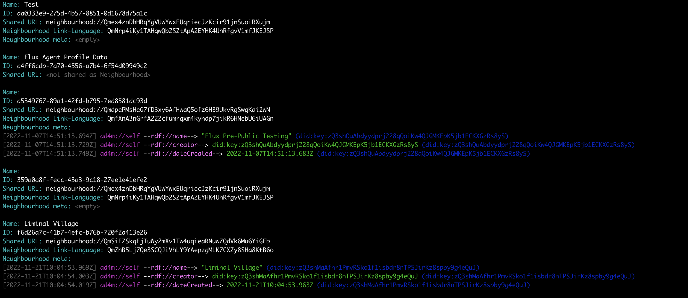

# AD4M Executables


This package contains command line tools for the Agent-Centric Distributed Application Meta-ontology (ADAM, aka AD4M), a framework for building interoperable, decentralized applications. It provides developers with the tools to control and script the functionalities of AD4M, leveraging the power of the Rust implementation of the AD4M GraphQL interface wrapper.

The purpose of these CLIs is development, scripting, and remote control of AD4M features,
as well as programatic setup and running of ADAM agents.

## Installation

This crate is published to crates.io and can be installed via `cargo install ad4m`. 
But several dependent crates have non-Rust dependencies which need to be installed.

### Build dependencies

#### Rust version
Make sure you have `rustup` installed (follow instructions [here](https://www.rust-lang.org/tools/install)).
Use rustup to install the latest stable Rust version.

ADAM currently needs at least Rust version:
```
1.81.0
```

#### Rust WASM target for Holochain based Languages
For building Holochain DNAs, which are part of the ADAM bootstrap languages included here
you need your Rust toolchain to be able to compile to WASM.

Run the following command to install the WASM target:
```
rustup target add wasm32-unknown-unknown
```

#### Go
Holochain currently depends on [Go](https://go.dev) being installed at version 1.21 or later.
Follow the installation instructions on [https://go.dev/doc/install](https://go.dev/doc/install).

Make sure `go` is in your `$PATH` before you continue. Output of `go version` should look like this:
```
go version go1.21.0 darwin/arm64
```

#### Platform specific dependencies
Run the following commands depending on your operating system to get all the system libraries installed that are needed by some of the Rust crates that Holochain and ADAM depend on.

##### macOS
Ensure you have [Homebrew](https://brew.sh/) installed and then run:
```
brew install protobuf cmake
```

##### Linux (Ubuntu / Debian)
```
sudo apt-get update
sudo apt-get install -y libgtk-3-dev webkit2gtk-4.0 libappindicator3-dev librsvg2-dev patchelf protobuf-compiler cmake
```

##### Windows
Ensure you have [Chocolatey](https://chocolatey.org/) installed and then run:
```
choco install strawberryperl protoc cmake curl cygwin gnuwin32-m4 msys2 make mingw
```


### Install command
Install AD4M using Cargo, Rust's package manager:
```
cargo install ad4m
```

This command installs two binaries:
- `ad4m`: The client for interacting with the executor.
- `ad4m-executor`: The executor that runs the AD4M agent.


## Getting Started

Initialize the AD4M executor with:
```
ad4m-executor init
```

This will create a new agent/config directory in ~/.ad4m.

Run the executor (i.e. the ADAM agent/node) using:
```
ad4m-executor run
```

## Interacting with AD4M

Use the `ad4m` client to interact with the executor. Here are some common commands:

### Generate and unlock agent
A fresh install will first need a new agent to be created, which requires a password
which is used to encrypt the agent's keys:

```
ad4m agent generate
```

This command will prompt for a new password.
Future runs of the executor require the wallet to be unlocked with

```
ad4m agent unlock
```
providing the same password.


Show all perspectives:
```
ad4m perspectives
```

### Query Perspectives


Query links of a perspective by its UUID:
```
ad4m perspectives query-links <perspective-UUID>
```


Watch changes of a perspective in real-time:
```
ad4m perspectives watch <perspective-UUID>
```

### Creating neighbourhoods


Clone and publish a language from a template:
```
ad4m languages apply-template-and-publish <language-template-hash>
```

Publish a perspective as a Neighbourhood:
```
ad4m neighbourhoods create <perspective-UUID> <neighbourhood-template-hash>
```

For a full list of commands and their explanations, use:
```
ad4m --help
```

## Contributing

Contributions to AD4M are welcome! Please read our contributing guidelines and submit pull requests to our repository.

## License

AD4M is licensed under the [CAL-1.0](LICENSE).

## Screenshots


## More Information

For more information on AD4M and ADAM, visit our [official website](https://ad4m.dev) or check out the [core documentation](https://docs.ad4m.dev).
