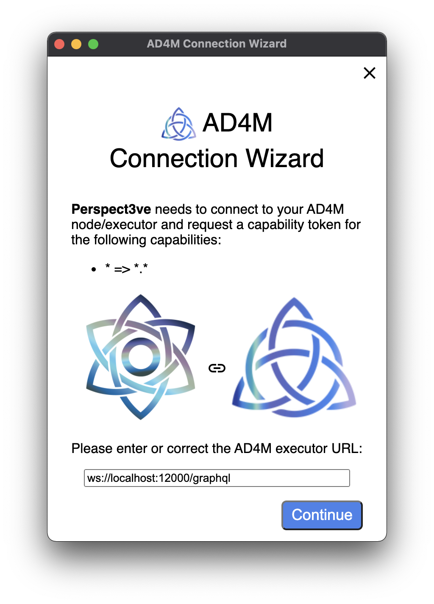

# AD4M connection library and wizard for apps

This package makes it easy for AD4M apps to connect to a local or remote AD4M executor by handling all the complex things like finding the local executor port, requesting and storing a capability token, creating and recreating an Ad4mClient.

<div style="text-align: center">
</img>
</div>

## Installation

`npm install -s @perspect3vism/ad4m-connect`

## Properties

- `appName(required)`: Name of the application using ad4m-connect.
- `appDesc(required)`: Description of the application using ad4m-connect.
- `appDomain(required)`: Domain of the application using ad4m-connect.
- `capabilities(required)`: Capabilities requested by the application.
- `appIconPath`: Icon for the app using ad4m-connect.
- `port`: Port that AD4M is running on.
- `token`: JWT token if you have one.
- `url`: The url that we should connect to.

## Events

- `authstatechange`: `authenticated` | `unauthenticated` | `locked`
- `connectionstatechange`: `connecting` | `connected` | `not_connected` | `disconnected` | `error`;
- `configstatechange`: `token` | `url` | `port`

## In the Browser

```js
import Ad4mConnectUI from "@perspect3vism/ad4m-connect";

const ui = Ad4mConnectUI({
  appName: "ad4m-connect-example",
  appDesc: "hello",
  appDomain: "dev.ad4m.connect.example",

  appIconPath: "https://i.ibb.co/GnqjPJP/icon.png",
  capabilities: [
    {
      with: { domain: "*", pointers: ["*"] },
      can: ["*"],
    },
  ],
});

ui.connect();

ui.addEventListener("authstatechange", (e) => {
  if (auth.authState === "connected") {
    console.log("connected");
  }
});
```

## Usage (from Node / Electron)

Call ad4mConnect with parameters of your app:

```js
const { ad4mConnect } = require("@perspect3vism/ad4m-connect/electron");

ad4mConnect({
  // Provide the name of your app to be displayed in the dialog
  appName: "Perspect3ve",
  // Provide an icon to be displayed in the dialog as well
  appIconPath: path.join(__dirname, "graphics", "Logo.png"),
  // Name the capabilities your app needs
  // (this is an example with all capabilities)
  capabilities: [{ with: { domain: "*", pointers: ["*"] }, can: ["*"] }],
  // Provide a directory in which the capability token and the executor
  // URL will be stored such that future calls won't even open a dialog
  // but try the token against that URL and resolve immediately
  // if it works.
  dataPath: path.join(homedir(), ".perspect3ve"),
})
  .then(({ client, capabilityToken, executorUrl }) => {
    // Retrieved `capabilityToken` and selected `executorUrl` are returned
    // but all that is really needed is `client` which is a fully setup
    // (including capability token) and working Ad4mClient.
    //
    // Both, the URL and the token have already been stored on disk
    // in the directory provided as `dataPath`.
    //
    // Consequetive calls
    createWindow(client);
  })
  .catch(() => {
    console.log("User closed AD4M connection wizard. Exiting...");
    app.exit(0);
    process.exit(0);
  });
```
