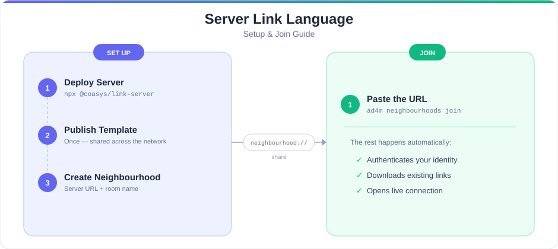

# @coasys/link-server

A self-hostable link language server for [AD4M](https://github.com/coasys/ad4m). Communities run this on their own hardware; AD4M agents authenticate with their DID and sync link data through it. Think Matrix homeserver, but purpose-built for AD4M link sync instead of chat.

**Companion package:** [`server-link-language`](../bootstrap-languages/server-link-language/README.md) — the AD4M link language that talks to this server.



## Quickstart

```bash
npx @coasys/link-server --port 3456 --data ./my-data
```

Or with Docker:

```bash
cd link-server
docker compose up -d
```

The server generates its own JWT signing secret on first run (`<data-dir>/data.sqlite`) and creates rooms on demand — there's no separate provisioning step.

## Run with Docker

Build and start the server:

```bash
cd link-server
docker compose up -d
```

The server listens on port 3456 and stores data in a named Docker volume (`link-server-data`). Override settings with environment variables:

```bash
PORT=4000 AUTO_ADMIT=true docker compose up -d
```

| Variable | Default | What it does |
|---|---|---|
| `PORT` | `3456` | Listen port (host and container) |
| `AUTO_ADMIT` | `false` | Admit every authenticating agent automatically |

The Dockerfile includes a `HEALTHCHECK` that polls `GET /health` every 30 seconds. Use `docker inspect` or `docker compose ps` to confirm the container reports healthy.

To stop:

```bash
docker compose down        # stop the container (data persists in the volume)
docker compose down -v     # stop and delete the data volume
```

## Usage

### Configuration

Control the server through environment variables or CLI flags:

| Environment variable | CLI flag | Default | What it does |
|---|---|---|---|
| `PORT` | `--port` | `3456` | Listen port |
| `DATA_DIR` | `--data` | `./data` | Storage directory (SQLite database) |
| `AUTO_ADMIT` | `--auto-admit` | `false` | Admit every agent automatically when they authenticate |
| `MAX_DIFFS_PER_ROOM` | `--max-diffs` | `10000` | Maximum diff entries retained per room (older entries pruned) |
| `BODY_LIMIT` | `--body-limit` | `10485760` | Maximum HTTP request body size in bytes (10 MiB) |

### Rooms

No room creation step needed. When the first agent authenticates against a room ID, the server creates that room and promotes the agent to **admin**. Every subsequent agent must pass the room's access control before they can read or write.

### Managing access

Without `AUTO_ADMIT`, only the admin can access the room. The admin adds or removes members through the `/acl` endpoint:

```bash
# Add a member
curl -X POST https://your-server:3456/rooms/YOUR_ROOM/acl \
  -H "Authorization: Bearer $ADMIN_TOKEN" \
  -H "Content-Type: application/json" \
  -d '{"action": "add", "did": "did:key:z6Mk..."}'

# Remove a member
curl -X POST https://your-server:3456/rooms/YOUR_ROOM/acl \
  -H "Authorization: Bearer $ADMIN_TOKEN" \
  -H "Content-Type: application/json" \
  -d '{"action": "remove", "did": "did:key:z6Mk..."}'

# List all members
curl https://your-server:3456/rooms/YOUR_ROOM/acl \
  -H "Authorization: Bearer $ADMIN_TOKEN"
```

For open communities, start the server with `AUTO_ADMIT=true` and skip member management entirely.

### Connecting AD4M agents to this server

The server handles storage and sync — it does not speak AD4M on its own. The companion [**server-link-language**](../bootstrap-languages/server-link-language/README.md) bridges the gap: AD4M agents load that language, which then connects to this server, authenticates, and syncs links automatically. See that package for instructions on publishing the language and creating neighbourhoods.

### End-to-end encryption (optional)

Encrypt link data so it cannot be read at rest or during transit:

```bash
# Enable or rotate the room key (admin only)
curl -X POST https://your-server:3456/rooms/YOUR_ROOM/keys/rotate \
  -H "Authorization: Bearer $ADMIN_TOKEN"
```

After rotation, each member receives a sealed copy of the new room key the next time they connect or refresh their key ring. Once a room has E2E enabled, the server rejects plaintext commits — a client without keys cannot write until it receives them.

After adding a new member to an encrypted room, run `keys/rotate` again so they receive the new version. The admin's language instance then automatically detects members missing historical key versions and re-seals those versions for them (see `performAdminKeyGrants` in server-link-language).

## How it works

- **Rooms** are independent link-sync spaces, identified by an opaque `roomId` the client chooses. The first agent to authenticate against a room becomes its admin.
- **Auth** is DID challenge-response: an agent proves control of its `did:key` ed25519 key by signing a server-issued nonce, and receives a JWT scoped to `(did, roomId)`.
- **ACL** gates every room endpoint. Only the admin can add/remove DIDs.
- **Links** are stored as an append-only diff log (`PerspectiveDiff` = additions/removals of signed `LinkExpression`s) plus a derived active-set table, so the room's state is always `replay(diffs)`. The **revision** is a content hash of the active set's link hashes — order-independent, so two servers with the same active links converge to the same revision regardless of how they got there.
- **WebSocket** push delivers committed diffs and telepresence events in real time.
- **E2E encryption** is opt-in per room: the entire `LinkExpression` (author, timestamp, proof, and data) becomes an opaque ciphertext blob. The server sees only `{ciphertext, nonce}` plus a client-computed `link_hash` for OR-Set dedup. Once enabled, the server rejects plaintext commits.

See [`AGENTS.md`](./AGENTS.md) for architecture, file layout, and implementation decisions made where the spec was ambiguous.

## API

All endpoints except `/rooms/:roomId/auth` require `Authorization: Bearer <jwt>`.

```text
POST /rooms/:roomId/auth      { did } -> { challenge }
                               { did, challenge, signature } -> { token, expiresAt }
POST /rooms/:roomId/commit    { additions: LinkExpression[], removals: LinkExpression[] } -> { sequence, revision }
GET  /rooms/:roomId/sync      ?since=<sequence> -> { diffs: PerspectiveDiff[], revision, sequence }
GET  /rooms/:roomId/render    -> { links: LinkExpression[], revision }
GET  /rooms/:roomId/revision  -> { revision, sequence }
GET  /rooms/:roomId/peers     -> { peers: string[] }               (currently online agents)
POST /rooms/:roomId/acl       { action: "add"|"remove", did } (admin only)
GET  /rooms/:roomId/acl       -> { admin, members: string[] }
GET  /rooms/:roomId/keys       -> { keys: [...], e2e_enabled } | 404 (no E2E)
GET  /rooms/:roomId/keys/missing  (admin only) -> { membersNeedingHistoricalKeys }
POST /rooms/:roomId/keys/rotate (admin only) -> { version, recipients, membersNeedingHistoricalKeys }
GET  /rooms/:roomId/ws              (WebSocket upgrade — first message must be {type:"auth",token:"<jwt>"})
```

### WebSocket messages

Server -> client: `diff`, `telepresence-signal`, `telepresence-broadcast`, `online-agents`, `peer-joined`, `peer-left`, `status-changed`, `auth-error`.
Client -> server: `auth { token }` (first message only), `telepresence-signal { toDid, payload }`, `telepresence-broadcast { payload }`, `set-online-status { status }`.

### Rate limits

100 req/min per IP on `/auth`, 300 req/min per JWT on room endpoints, 60 req/min per JWT on `/commit` specifically (stacked on top of the general room limit). Sliding window, in-memory. `429` responses carry `Retry-After` in seconds.

## Development

```bash
npm install       # NODE_ENV must not be "production" or devDependencies won't install
npm test          # node's built-in test runner, tests/*.test.ts
npm run build     # tsc -> dist/
npm run dev       # tsx src/index.ts, no build step
```

Tests boot a real server per test (random port, temp SQLite file) and drive it over real HTTP/WebSocket — there are no mocks of the server itself.

## Known limitations

### E2E encryption — trust model and future requirements

The current E2E implementation protects link data against **at-rest compromise
and passive observation** (an honest server operator cannot read room data after
the plaintext key leaves memory). It does **not** protect against a
**malicious server operator**:

- **Server-side key generation.** The server generates each room key and seals
  it to members in one pass. An honest server discards the plaintext key
  immediately — but a malicious operator could retain every key it generates.
  The client-side sealing primitives already exist (see `sealRoomKeyForRecipient`
  in server-link-language), so moving key generation to the admin client (admin
  generates, seals to each member, uploads sealed copies; server only stores)
  would close this gap without new primitives.
- **Unsigned X25519 public key.** The DID challenge signature covers only the
  nonce, not the `x25519PublicKey` field sent alongside it. A malicious server
  could substitute its own X25519 key for a member's during the rotate response
  (`membersNeedingHistoricalKeys`), causing the admin to seal historical keys
  to the server instead. Fix: require the client to send
  `signature = sign(x25519PublicKey)` at registration, store it, return it in
  rotate/missing-keys responses, and have the admin verify the DID signature before
  sealing. The signing capability already exists.

Until these are addressed, the E2E guarantee should be understood as
"protection against later compromise and honest-but-curious operators," not
"protection against the operator."

### E2E encryption — other future requirements

- **Admin succession / key revocation:** if the room admin's key gets
  compromised, no mechanism exists to rotate admin authority or revoke a
  leaked agent key retroactively. A compromised admin can seal new room keys
  for arbitrary recipients. Future work: admin transfer endpoint, key
  revocation list, and forward-secrecy ratchet for room keys.
- **Perfect forward secrecy:** room keys are long-lived. Compromising a room
  key exposes all past ciphertext sealed under it. A ratchet or epoch-based
  key rotation would bound the exposure window.
