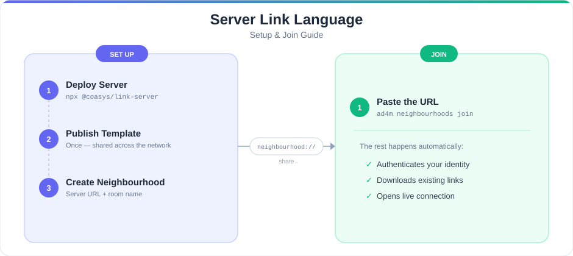

# @coasys/link-server

A self-hostable link language server for [AD4M](https://github.com/coasys/ad4m). Communities run this on their own hardware; AD4M agents authenticate with their DID and sync link data through it. Think Matrix homeserver, but purpose-built for AD4M link sync instead of chat.

**Companion package:** [`server-link-language`](../bootstrap-languages/server-link-language/README.md) — the AD4M link language that talks to this server.



## Quickstart

```bash
npx @coasys/link-server --port 3456 --data ./my-data
```

Or with Docker:

```bash
cd link-server
docker compose up -d
```

The server generates its own JWT signing secret on first run (`<data-dir>/data.sqlite`) and creates rooms on demand — there's no separate provisioning step.

## Run with Docker

Build and start the server:

```bash
cd link-server
docker compose up -d
```

The server listens on port 3456 and stores data in a named Docker volume (`link-server-data`). Override settings with environment variables:

```bash
PORT=4000 AUTO_ADMIT=true docker compose up -d
```

| Variable | Default | What it does |
|---|---|---|
| `PORT` | `3456` | Listen port (host and container) |
| `AUTO_ADMIT` | `false` | Admit every authenticating agent automatically |

The Dockerfile includes a `HEALTHCHECK` that polls `GET /health` every 30 seconds. Use `docker inspect` or `docker compose ps` to confirm the container reports healthy.

To stop:

```bash
docker compose down        # stop the container (data persists in the volume)
docker compose down -v     # stop and delete the data volume
```

## Usage

### Configuration

Control the server through environment variables or CLI flags:

| Environment variable | CLI flag | Default | What it does |
|---|---|---|---|
| `PORT` | `--port` | `3456` | Listen port |
| `DATA_DIR` | `--data` | `./data` | Storage directory (SQLite database) |
| `AUTO_ADMIT` | `--auto-admit` | `false` | Admit every agent automatically when they authenticate |
| `MAX_DIFFS_PER_ROOM` | `--max-diffs` | `10000` | Maximum diff entries retained per room (older entries pruned) |
| `BODY_LIMIT` | `--body-limit` | `10485760` | Maximum HTTP request body size in bytes (10 MiB) |
| `OPERATOR_PORT` | `--operator-port` | off | Also serve the [admission UI](#admission-ui-operator-listener) and its API on this port |
| `OPERATOR_HOST` | `--operator-host` | `127.0.0.1` | Address of the operator listener; must be loopback |
| `OPERATOR_TOKEN_FILE` | `--operator-token-file` | none | File (mode 600) holding the operator API token; required with `--operator-port` |
| `OPERATOR_ORIGINS` (comma-separated) | `--operator-origin` (repeatable) | none | Origin the admission page is served from; POSTs from anywhere else are refused. Required with `--operator-port` |
| `OPERATOR_LABEL` | `--operator-label` | none | Instance name shown on the admission page (`staging`, `prod`) |

### Rooms

No room creation step needed. When the first agent authenticates against a room ID, the server creates that room and promotes the agent to **admin**. Every subsequent agent must pass the room's access control before they can read or write.

### Managing access

Without `AUTO_ADMIT`, only the admin can access the room. The admin adds or removes members through the `/acl` endpoint:

```bash
# Add a member
curl -X POST https://your-server:3456/rooms/YOUR_ROOM/acl \
  -H "Authorization: Bearer $ADMIN_TOKEN" \
  -H "Content-Type: application/json" \
  -d '{"action": "add", "did": "did:key:z6Mk..."}'

# Remove a member
curl -X POST https://your-server:3456/rooms/YOUR_ROOM/acl \
  -H "Authorization: Bearer $ADMIN_TOKEN" \
  -H "Content-Type: application/json" \
  -d '{"action": "remove", "did": "did:key:z6Mk..."}'

# List all members
curl https://your-server:3456/rooms/YOUR_ROOM/acl \
  -H "Authorization: Bearer $ADMIN_TOKEN"
```

For open communities, start the server with `AUTO_ADMIT=true` and skip member management entirely.

Removing a DID ends its access at once: its sessions are revoked and its open WebSockets are closed (code `4005`).

### Admission UI (operator listener)

The `/acl` endpoint needs a JWT of the room admin's DID, and only the executor holding that agent's key can get one. The neighbourhood's creator is often on a laptop, so whoever runs the server can turn on a second listener with a small web page and API to list rooms and admit or remove DIDs:

```bash
umask 077; openssl rand -hex 32 > /srv/link-server/operator-token     # mode 600, never on argv
link-server --host 127.0.0.1 --port 13102 --data /srv/link-server/data \
  --operator-port 13104 --operator-token-file /srv/link-server/operator-token \
  --operator-origin https://admin.example.org --operator-label prod
```

One listener serves one instance. Run staging and prod as separate servers with separate operator ports, mounted at separate paths, so a page never switches between instances.

- The listener binds to loopback only and refuses any other address. It is a separate Fastify app, so the public port never serves it.
- Every `/api/*` call needs `Authorization: Bearer <operator token>`, compared in constant time. The token is read from a file that only its owner may read. It never goes on argv or into a URL, and the request log has no headers in it.
- Every `/api/*` call also needs `X-Forwarded-User`, the signed-in login (GitHub login syntax). The proxy sets it from the sign-in subrequest. The header is trusted only because the listener is loopback-only and reached through that proxy, and the proxy must overwrite any value a client sends.
- CSRF: the sign-in is a cookie, so every `POST` needs an `Origin` from `--operator-origin`. When a browser sends no `Origin`, a `Referer` on that origin is accepted instead. A request with neither is refused, as is one marked `Sec-Fetch-Site: cross-site`. `POST` also needs `Content-Type: application/json`.
- **Who admitted whom:** every admit and remove is stored in the `acl_changes` table with the login (`source: "operator"`) and logged as `operator acl change`. Changes the room admin makes through `POST /rooms/:id/acl` are stored too, with the admin DID (`source: "room-admin"`). `GET /api/rooms/:id` returns them as `history`, and each member's `addedBy`.
- The operator only manages rooms that exist (rooms are still created by their first agent). The operator cannot remove the room admin.

**Trust model.** This gives the operator no power it does not already have: the server owns the ACL (and the SQLite file). But it makes ACL changes by the operator a supported path. The admin's server-link-language grants room keys to every ACL member that lacks them, so **a DID the operator admits can read the room's encrypted history** once the admin's executor has been online. Only run this listener where the server's operator is trusted with membership. Removing a member does not rotate the room key: the removed DID keeps the keys it had, but the ACL check stops it from fetching anything new.

**Wiring it behind a sign-in.** Put a reverse proxy in front that signs the human in and injects the token, so the browser never holds it. With nginx and [oauth2-proxy](https://oauth2-proxy.github.io/oauth2-proxy/) (GitHub provider, `github_users` allowlist = the operators), on a host of its own:

```nginx
server {
    listen 443 ssl;
    server_name link-admin.example.org;
    # ssl_certificate ... ;
    add_header X-Robots-Tag "noindex, nofollow" always;
    client_max_body_size 16k;

    location /oauth2/ {
        proxy_pass http://127.0.0.1:4181;       # oauth2-proxy for this host
        proxy_set_header Host $host;
        proxy_set_header X-Real-IP $remote_addr;
        proxy_set_header X-Forwarded-Proto $scheme;
        proxy_set_header X-Auth-Request-Redirect "";
    }
    location = /oauth2/auth {
        internal;
        proxy_pass http://127.0.0.1:4181;
        proxy_pass_request_body off;
        proxy_set_header Content-Length "";
        proxy_set_header Host $host;
        proxy_set_header X-Real-IP $remote_addr;
        proxy_set_header X-Forwarded-Proto $scheme;
        proxy_set_header X-Forwarded-Uri $request_uri;
    }
    location @sign_in { return 302 /oauth2/start?rd=$request_uri; }

    location / {
        auth_request /oauth2/auth;
        error_page 401 = @sign_in;
        auth_request_set $op_user $upstream_http_x_auth_request_user;
        auth_request_set $op_cookie $upstream_http_set_cookie;
        add_header Set-Cookie $op_cookie;
        add_header X-Robots-Tag "noindex, nofollow" always;

        proxy_pass http://127.0.0.1:13104;
        # One line, root-only file (mode 600):  proxy_set_header Authorization "Bearer <operator token>";
        # proxy_set_header replaces whatever Authorization the client sent.
        include /etc/nginx/snippets/link-admin-token.conf;
        proxy_set_header Host $host;
        proxy_set_header X-Forwarded-User $op_user;   # set here, never passed through
        proxy_set_header Cookie "";                   # the sign-in cookie stays at the proxy
        proxy_set_header X-Real-IP $remote_addr;
    }
}
```

```toml
# oauth2-proxy.cfg (client secret and cookie secret in files, not here)
provider = "github"
client_id = "<GitHub OAuth app for link-admin.example.org>"
client_secret_file = "/path/to/client-secret"        # mode 600
cookie_secret_file = "/path/to/cookie-secret"        # mode 600
redirect_url = "https://link-admin.example.org/oauth2/callback"
github_users = ["alice", "bob"]
email_domains = ["*"]
http_address = "127.0.0.1:4181"
reverse_proxy = true
upstreams = ["static://202"]
set_xauthrequest = true
cookie_name = "_link_admin_oauth2"
cookie_secure = true
cookie_samesite = "lax"
```

The page uses relative URLs, so it also works mounted under a path on a host that already has an oauth2-proxy sign-in, one path per instance: `location /link-admin/staging/ { ... proxy_pass http://127.0.0.1:13105/; }`. Start that instance with `--operator-origin https://<that host>`.

### Connecting AD4M agents to this server

The server handles storage and sync — it does not speak AD4M on its own. The companion [**server-link-language**](../bootstrap-languages/server-link-language/README.md) bridges the gap: AD4M agents load that language, which then connects to this server, authenticates, and syncs links automatically. See that package for instructions on publishing the language and creating neighbourhoods.

### End-to-end encryption (optional)

E2E encryption uses **true client-side key generation**: the admin's language client generates each room key locally, seals it to every member's X25519 public key via ECIES (ephemeral X25519 ECDH + HKDF-SHA256 + AES-256-GCM), and uploads only the sealed envelopes. The server never sees the plaintext key.

```bash
# Enable or rotate the room key (admin only).
# The client generates the key, fetches ACL for X25519 public keys,
# seals the key to each member, and POSTs only sealed envelopes:
curl -X POST https://your-server:3456/rooms/YOUR_ROOM/keys/rotate \
  -H "Authorization: Bearer $ADMIN_TOKEN" \
  -H "Content-Type: application/json" \
  -d '{"keys": [{"did": "did:key:z6Mk...", "encryptedKey": {"ephemeralPublicKey": "...", "nonce": "...", "ciphertext": "..."}}]}'
```

After rotation, each member receives a sealed copy of the new room key the next time they connect or refresh their key ring. Once a room has E2E enabled, the server rejects plaintext commits — a client without keys cannot write until it receives them.

After adding a new member to an encrypted room, rotate again so they receive the new version. The admin's language instance then automatically detects members missing historical key versions and re-seals those versions for them (see `performAdminKeyGrants` in server-link-language).

## How it works

- **Rooms** are independent link-sync spaces, identified by an opaque `roomId` the client chooses. The first agent to authenticate against a room becomes its admin.
- **Auth** is DID challenge-response: an agent proves control of its `did:key` ed25519 key by signing a server-issued nonce, and receives a JWT scoped to `(did, roomId)`.
- **ACL** gates every room endpoint. Only the admin can add/remove DIDs.
- **Links** are stored as an append-only diff log (`PerspectiveDiff` = additions/removals of signed `LinkExpression`s) plus a derived active-set table, so the room's state is always `replay(diffs)`. The **revision** is a content hash of the active set's link hashes — order-independent, so two servers with the same active links converge to the same revision regardless of how they got there.
- **WebSocket** push delivers committed diffs and telepresence events in real time.
- **E2E encryption** is opt-in per room: the entire `LinkExpression` (author, timestamp, proof, and data) becomes an opaque ciphertext blob. The server sees only `{ciphertext, nonce}` plus a client-computed `link_hash` for OR-Set dedup. Once enabled, the server rejects plaintext commits.

See [`AGENTS.md`](./AGENTS.md) for architecture, file layout, and implementation decisions made where the spec was ambiguous.

## API

All endpoints except `/rooms/:roomId/auth` require `Authorization: Bearer <jwt>`.

```text
POST /rooms/:roomId/auth      { did } -> { challenge }
                               { did, challenge, signature } -> { token, expiresAt }
POST /rooms/:roomId/commit    { additions: LinkExpression[], removals: LinkExpression[] } -> { sequence, revision }
GET  /rooms/:roomId/sync      ?since=<sequence> -> { diffs: PerspectiveDiff[], revision, sequence }
GET  /rooms/:roomId/render    -> { links: LinkExpression[], revision }
GET  /rooms/:roomId/revision  -> { revision, sequence }
GET  /rooms/:roomId/peers     -> { peers: string[] }               (currently online agents)
POST /rooms/:roomId/acl       { action: "add"|"remove", did } (admin only)
GET  /rooms/:roomId/acl       -> { admin, members: [{did, x25519PublicKey}] }
GET  /rooms/:roomId/keys       -> { keys: [...], e2e_enabled } | 404 (no E2E)
GET  /rooms/:roomId/keys/missing  (admin only) -> { membersNeedingHistoricalKeys }
POST /rooms/:roomId/keys/rotate (admin only) -> { version, recipients, membersNeedingHistoricalKeys }
GET  /rooms/:roomId/ws              (WebSocket upgrade — first message must be {type:"auth",token:"<jwt>"})
```

Operator listener (only with `--operator-port`; all `/api/*` need the operator token):

```
GET  /                          admission page (+ /admin.js)
GET  /api/whoami                -> { operator, instance }   (X-Forwarded-User, --operator-label)
GET  /api/rooms                 -> { rooms: [{ id, admin, e2e, createdAt, memberCount }] }
GET  /api/rooms/:roomId         -> { id, admin, e2e, createdAt,
                                     members: [{ did, addedAt, hasX25519Key, online, addedBy: { actor, source, at } | null }],
                                     history: [{ did, action, actor, source, at }] }   (newest first, last 100)
POST /api/rooms/:roomId/acl     { action: "add"|"remove", did } -> same as GET /api/rooms/:roomId
```

### WebSocket messages

Server -> client: `diff`, `telepresence-signal`, `telepresence-broadcast`, `online-agents`, `peer-joined`, `peer-left`, `status-changed`, `auth-error`.
Client -> server: `auth { token }` (first message only), `telepresence-signal { toDid, payload }`, `telepresence-broadcast { payload }`, `set-online-status { status }`.

### Rate limits

100 req/min per IP on `/auth`, 300 req/min per JWT on room endpoints, 60 req/min per JWT on `/commit` specifically (stacked on top of the general room limit). Sliding window, in-memory. `429` responses carry `Retry-After` in seconds.

## Development

```bash
npm install       # NODE_ENV must not be "production" or devDependencies won't install
npm test          # node's built-in test runner, tests/*.test.ts
npm run build     # tsc -> dist/
npm run dev       # tsx src/index.ts, no build step
```

Tests boot a real server per test (random port, temp SQLite file) and drive it over real HTTP/WebSocket — there are no mocks of the server itself.

## Known limitations

### E2E encryption — trust model and remaining gaps

Key generation now happens exclusively client-side — the admin generates each
room key locally, seals it to members' X25519 public keys, and uploads only
sealed envelopes. The server never touches plaintext key material. This closes
the most significant trust gap (server-side key generation).

**Remaining gap:**

- **Unsigned X25519 public key.** The DID challenge signature covers only the
  nonce, not the `x25519PublicKey` field sent alongside it. A malicious server
  could substitute its own X25519 key for a member's during the ACL or
  `membersNeedingHistoricalKeys` response, causing the admin to seal keys
  to the server instead of the real member. Fix: require the client to send
  `signature = sign(x25519PublicKey)` at registration, store it, return it in
  ACL/missing-keys responses, and have the admin verify the DID signature before
  sealing. The signing capability already exists.

With this gap open, the E2E guarantee protects against passive observation
and later compromise, but not against an actively malicious server operator
who tampers with X25519 public keys at registration time.

### E2E encryption — other future requirements

- **Admin succession / key revocation:** if the room admin's key gets
  compromised, no mechanism exists to rotate admin authority or revoke a
  leaked agent key retroactively. A compromised admin can seal new room keys
  for arbitrary recipients. Future work: admin transfer endpoint, key
  revocation list, and forward-secrecy ratchet for room keys.
- **Perfect forward secrecy:** room keys are long-lived. Compromising a room
  key exposes all past ciphertext sealed under it. A ratchet or epoch-based
  key rotation would bound the exposure window.
