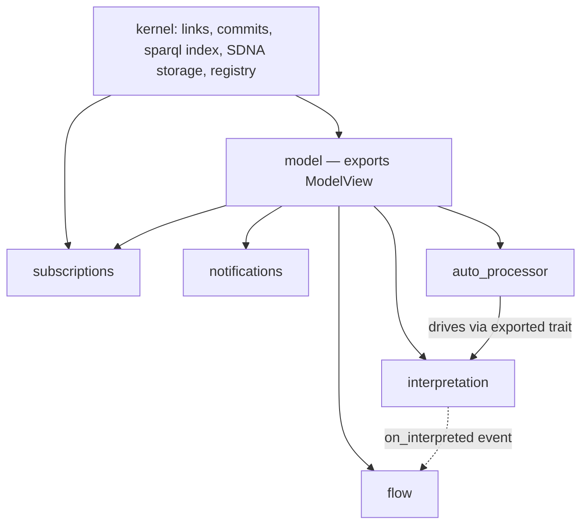
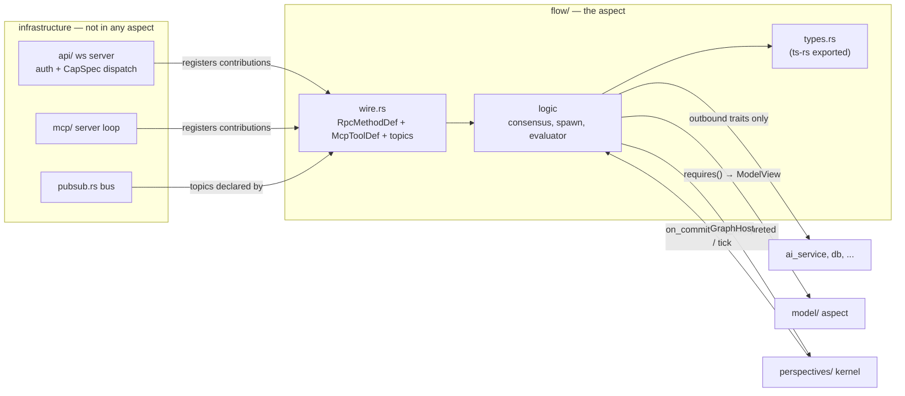

# Aspect holons — target structure, traits, and wire design

Date: 2026-09-04 (rev 2, same evening). Status: proposed (phase 2). Owner: core team.

This is the second phase of the rust-executor refactoring programme. Phase 1 is
`planning/rust-executor-refactoring-spec-2026-09-04.md` — the mechanical cleanup
— and it runs first and is worth doing regardless of this document. This
document describes what the cleaned-up crate is *for*: a target architecture in
which the perspective's features — flows, interpretation, the auto-processor,
**and equally the model layer, subscriptions, and notifications** — are
**aspects**: holon-shaped modules hosted by a Perspective, each understandable,
testable, and extendable from inside its own boundary.

The name: these were called "aspects as plugins" in the PR discussion; "aspect
holons" names the goal more honestly. A holon is whole at its own level
(complete contract, own tests, own docs) and a part at the next level up (the
host dispatches to it, the wire layers aggregate it).

Rev 2 note: the first revision of this document put `model_query` in the host
and treated notifications as a maybe-later. That made the plugin system too
narrow — a mechanism that only fits the three newest features isn't an
architecture, it's a special case. This revision fixes that by splitting what
rev 1 conflated: **being an aspect** (module shape, contract, dependency
discipline) is now separate from **being optional** (an activation policy).
The host shrinks to a kernel; everything else — including `Ad4mModel`/
`ModelQuery` — is an aspect.

Questions this document answers, from the 2026-09-04 evening discussion:

1. What would the aspects be, and what is the target structure?
2. What is the aspect trait, concretely — and is it feasible?
3. Is the API service part of the aspect? Is WebSocket stuff inside aspects?
4. Some parts live client-side (TS) and some in the Rust backend — does an
   aspect span that boundary?
5. Do `Ad4mModel`/`ModelQuery`, subscriptions, and notifications fit the same
   plugin system? (Rev 2: yes — this section is new.)
6. What about things beyond the perspective, like Languages?

## 1. Kernel and aspects

The crate has exactly two kinds of citizens inside a perspective, plus the
executor-wide services around it:

| Kind | Contents | Test for membership |
|---|---|---|
| **Kernel** | Link storage + commit pipeline (diffs, status), `sparql_store` as the graph *index* (the commit path writes it — `perspective_instance.rs:557,622`), sync/neighbourhood plumbing, SDNA *storage*, the aspect registry + event dispatch | *Produces* the commit stream, or is the storage the stream lands in. Cannot be expressed as a subscriber to itself. |
| **Aspects** | `model/`, `subscriptions/`, `notifications/`, `flow/`, `interpretation/`, `auto_processor/` | Consumes the commit stream (or another aspect's exported trait) and adds behaviour. Expressible as: react to events, read/write links, contribute wire surface. |
| **Capability services** | `ai_service`, `db`, `prolog_service`, `holochain_service`, `languages`, `agent`, billing | Executor-wide infrastructure. Aspects reach them only through outbound traits. |

An aspect has two **orthogonal properties**, and rev 1's mistake was collapsing
them into one:

**(a) Its tier in the dependency DAG.** Aspects may export a service trait that
other aspects declare a dependency on. `model` is foundational: it exports
`ModelView` (typed queries, shape resolution, subject-class matching) and
almost everything else consumes it. That does not disqualify it from being an
aspect — it makes it a *foundational* aspect, the same way a base library is
still a library.



**(b) Its activation policy.** Three values, declared per aspect:

| Policy | Meaning | Who |
|---|---|---|
| `always` | Registered and active in every perspective | `model`, `subscriptions` |
| `sdna` | Active when its social DNA is present in the graph (§5) | `flow`, `interpretation` |
| `config` | Active when runtime config enables it | `auto_processor`, `notifications` (active only when a notification is registered against the perspective) |

The honest caveat, kept from rev 1: making `model` an aspect does **not** make
it deletable — a kernel with no model layer is not a usable AD4M, and no SDNA
switch will ever turn `ModelView` off. What uniformity buys is not
optionality; it is that *one* mechanism, *one* contract template, *one*
dependency discipline, and *one* review rule cover the whole crate — and that
the difference between `model` and `flow` is a declared policy value, not a
caste distinction with different rules per ring.

## 2. The traits

Three pieces define the seam: the host trait, the aspect trait, and per-aspect
exported/outbound traits. The host/aspect pair lives in
`perspectives/host.rs` — traits only, no logic.

```rust
/// What the kernel offers every aspect. Rev 2: deliberately *smaller* than
/// rev 1 — model_query and shape resolution are gone from here, because they
/// belong to the model aspect. What remains is what the kernel alone can
/// answer: identity, raw links, and the read handle on the graph index.
/// If GraphHost grows back toward the full PerspectiveInstance surface,
/// nothing was encapsulated — that is the design's failure condition.
#[async_trait]
pub trait GraphHost: Send + Sync {
    fn uuid(&self) -> &str;
    fn did(&self) -> &str;
    async fn get_links(&self, q: &LinkQuery) -> Result<Vec<DecoratedLinkExpression>>;
    async fn add_links(&self, links: Vec<Link>, status: LinkStatus) -> Result<Vec<DecoratedLinkExpression>>;
    async fn remove_links(&self, links: Vec<DecoratedLinkExpression>) -> Result<()>;
    /// Read-only handle on the SPARQL index the commit path maintains.
    fn index(&self) -> Arc<SparqlRead>;
    /// SDNA triples, raw — *interpreting* them (shapes, classes) is model's job.
    async fn sdna(&self) -> Result<Vec<DecoratedLinkExpression>>;
}

/// What an aspect offers the host. Events are coarse — per committed diff,
/// per interpretation outcome, per tick — never per link, so the hot write
/// path pays one dynamic dispatch per registered-and-activated aspect, not
/// one per triple.
#[async_trait]
pub trait PerspectiveAspect: Send + Sync {
    fn name(&self) -> &'static str;

    /// Names of aspects this one depends on. The registry initializes in
    /// topological order and hands each aspect its dependencies' exported
    /// trait objects at construction. A cycle is a registration panic.
    fn requires(&self) -> &[&'static str];

    /// Activation policy (§1b). For Sdna, the URIs whose presence in the
    /// perspective's SDNA switch this aspect on.
    fn activation(&self) -> Activation; // Always | Sdna(&[&'static str]) | Config

    async fn on_commit(&self, host: &dyn GraphHost, diff: &CommittedDiff) -> Result<()>;
    async fn on_interpreted(&self, host: &dyn GraphHost, outcome: &InterpretationOutcome) -> Result<()>;
    async fn tick(&self, host: &dyn GraphHost) -> Result<()>;

    /// Wire contribution — see §3. Collected once at registration.
    fn wire(&self) -> WireContribution;
}
```

**Exported traits** are how foundational aspects serve the others — the same
mechanism as outbound capability traits, but aspect-to-aspect. The model
aspect exports:

```rust
// model/exported.rs — what other aspects may consume; everything else private
#[async_trait]
pub trait ModelView: Send + Sync {
    async fn model_query(&self, q: &ModelQuery) -> Result<serde_json::Value>;
    async fn resolve_shape(&self, class: &str) -> Result<Option<Shape>>;
    async fn classes_of(&self, base: &str) -> Result<Vec<String>>;
}
```

Flow code today calls shape resolution and `subject_classes_of` through the
perspective; under this design it declares `requires: ["model"]` and receives
an `Arc<dyn ModelView>`. The import edge is explicit, typed, and mockable —
a flow test can run against a canned `ModelView` with no SPARQL store at all,
which is currently impossible.

Outbound capability traits (aspect → executor service) are unchanged from
rev 1: per-need, defined by the aspect, implemented by the service — the
aspect never imports the service:

```rust
// flow/traits.rs — the aspect declares what it needs
#[async_trait]
pub trait SemanticCheck: Send + Sync {
    async fn check(&self, hint: &str, evidence: &str) -> Result<SemanticVerdict>;
}
```

**Feasibility — the proven parts:**

- The `interpretation → flow` coupling is an *import, not a data dependency*:
  `interpretation/run.rs` calls `flow_evaluator::run_engine_proposal_pass`
  directly at the end of its pass. Replacing that call with
  `host.dispatch_interpreted(outcome)` changes no data flow, and turns the
  #940 round-2 bug class (threading the wrong subject list across a module
  boundary) into a compile error, because the event type carries the scope.
- The mock seam already exists and carried this week's work: `CannedLlm` vs
  `AIServiceSemanticCheck` is precisely an outbound trait with a test
  implementation.
- `model_query/` is *already a directory with a de-facto boundary*: seven
  files, ~5.8k lines, whose only inbound surface is the query entry points and
  whose only downward dependency is `sparql_store` reads (verified: every
  `use` of the store in `model_query/*` is read-side). Making it an aspect is
  mostly declaring true things.
- `notification_check_loop` (`perspective_instance.rs:1167`) is already
  event-shaped: a trigger flag set on commit, a snapshot diff, a publish. It
  is an `on_commit` + `tick` implementation written out longhand.
- Live query subscriptions (`prolog_query_subscription*`,
  `PERSPECTIVE_QUERY_SUBSCRIPTION_TOPIC`, the `events_ws.rs` surface) are
  already a self-contained react-to-commits-and-publish unit.

Sequencing of the registry: `Vec<Arc<dyn PerspectiveAspect>>` on
`PerspectiveInstance` until spec item 11 lands, then it moves to `AppContext`.

## 3. Wire surfaces: is the API service part of the aspect?

Split the question in two, because the current `api/` directory contains two
different things:

- **Transport** — the WebSocket server, connection lifecycle, auth,
  capability checking, JSON-RPC dispatch (`ws_rpc.rs`, `ws_handler.rs`,
  `auth.rs`), the pubsub *bus* (`pubsub.rs`), and the MCP server loop
  (`mcp/server.rs`). Infrastructure. **Not** part of any aspect; never moves.
- **Surface definitions** — *which* RPC methods exist, their parameter types,
  their capability requirements, their handler bodies; *which* MCP tools
  exist and their schemas; *which* pubsub topics exist and what they carry.
  These are statements *about an aspect's contract* and they **belong to the
  aspect**.

The mechanism is the `WireContribution` an aspect returns at registration:

```rust
pub struct WireContribution {
    /// ("perspective.flowAccept", CapSpec::PerspectiveScoped(..), handler fn)
    pub rpc_methods: Vec<RpcMethodDef>,
    /// MCP tool definitions + handlers (the shape mcp/tools/flows.rs has today)
    pub mcp_tools: Vec<McpToolDef>,
    /// PubSub topics this aspect publishes (subscription surface)
    pub topics: Vec<&'static str>,
}
```

`api/` collects contributions into its `HandlerMap`; `mcp/` collects tool defs
into its tool list. Spec **item 6 (declarative handler registration with
`CapSpec`) is the enabling prerequisite**: once registration is data instead of
hand-written match arms, it makes no difference to the dispatcher whether the
data came from `perspectives_ws.rs` or from an aspect — which is why item 6
stays in phase 1 and why this phase costs little once it lands.

Rev 2 consequence: the topic constants now centralised in `pubsub.rs`
(`PERSPECTIVE_LINK_ADDED_TOPIC`, `RUNTIME_NOTIFICATION_TRIGGERED_TOPIC`,
`AUTO_PROCESSOR_EVENT_TOPIC`, …) disperse to their owning aspects'
`wire()` — the bus stays in `pubsub.rs`, the *vocabulary* moves to whoever
speaks it. That is the same split as WS: socket stays, surface moves.

So, concretely: **WebSocket handler *bodies* for flow methods live in
`flow/wire.rs`. The WebSocket itself lives in `api/`.** Same for MCP, same
for pubsub topics.

The flow wire slice of #968 shows both the target and the gap in one diff:

| File | Status vs target |
|---|---|
| `mcp/tools/flows.rs` | ✅ already aspect-shaped: one file, owned by flows |
| `api/perspectives_ws.rs` | ❌ flow handlers added to a shared 2,400-line file |
| `core/src/perspectives/PerspectiveClient.ts` / `PerspectiveProxy.ts` | ❌ flow client methods added to shared client classes |
| `core/src/perspectives/FlowInstance.ts` | ❌ flow model parked in the perspectives client dir |

MCP already lives the pattern. The refactor extends it to the other surfaces.



## 4. The client side: does an aspect span Rust and TypeScript?

**Yes — as a contract and a naming discipline, not as shared code.** An aspect
is a vertical slice through four layers, tied together by code generation:

| Layer | Where | Owned by the aspect? |
|---|---|---|
| Rust logic + wire handlers | `rust-executor/src/flow/` | yes |
| Wire types | `#[ts(export)]` on the aspect's `types.rs`, generated into `core/src/generated/api/` via `pnpm generate:api-types` | yes (the Rust side is the single source of truth) |
| TS client module | `core/src/flow/` — proxy methods, model classes (`FlowInstance.ts` moves here), client-side helpers | yes |
| English contract | `flow/AGENTS.md` (server) — its **Boundary section lists every path the aspect owns across all four layers**, including the TS ones | yes |

Rev 2 makes this stronger, not weaker: **the model aspect is the existence
proof that the vertical slice works**, because its client half already exists
as a coherent module — `core/src/model/` (`Ad4mModel`, `ModelQuery`, the
decorators) is today the best-factored client directory in the SDK. The
refactor doesn't invent the model aspect's TS side; it recognises it, and
gives its Rust side (`model_query/` + shape resolution) the same clean
boundary. Subscriptions likewise span naturally: server half owns the topics
and the live-query re-run machinery; client half owns `addListener`/
subscription helpers.

What makes the span real rather than aspirational:

- **Codegen is the spanning mechanism.** The generated types in
  `core/src/generated/api/` are the aspect's wire contract compiled for the
  other side. CI fails if the generated directory is dirty after
  `generate:api-types` (spec §5.7), so Rust↔TS drift is mechanical to catch.
  (The `FireOutcome` hand-written TS interface in #968 is the current
  counterexample and already has a follow-up to switch to the generated type.)
- **The holon acceptance test extends across the boundary**: a PR adding a
  flow feature touches only paths listed in `flow/AGENTS.md`'s Boundary — on
  both sides of the wire. Touching a second aspect's files requires a stated
  reason in the PR description. Checkable in review today, lintable later.
- **Facades stay, logic moves.** `PerspectiveProxy` keeps thin delegating
  methods (`proxy.flowAccept(...)` calling into `core/src/flow/`) so the
  public SDK surface stays stable per spec ground rule 6. The facade is
  allowed to be a table of contents; it is not allowed to contain aspect
  logic.

What an aspect does **not** span: the client bundle is not plugin-loaded. Both
sides compile the aspect in; activation policy (§1b) decides at *runtime*, per
perspective, whether it does anything. Client-side dead code for an unused
aspect is a bundle-size concern, not a correctness concern, and tree-shaking
handles it if the module boundaries are clean — one more reason for per-aspect
TS modules instead of methods on a shared class.

## 5. SDNA activation — the AD4M-native half

A Language is code addressed by data: a language address in a perspective
handle activates it. An SDNA-activated aspect is the same pattern internally:
**code activated by the presence of its social DNA in the graph.** The
registry holds all compiled-in aspects; before dispatching events, the kernel
checks each aspect's `activation()` — `Always` short-circuits, `Sdna(uris)`
is checked against the perspective's SDNA (cached, invalidated on SDNA
change — `inbound_touches_shacl` already exists for exactly this trigger),
`Config` against runtime state.

What this buys:

- A perspective with no `SHACLFlow` definitions never runs a spawn pass, never
  pays flow's cost, never needs flow's invariants held in anyone's head.
- **Joining a neighbourhood whose SDNA declares flows wakes the flow aspect
  up.** Flows + ontologies become literally shareable social-DNA modules — the
  sentence from the flows vision doc, made mechanical.
- A horizon, deliberately out of scope this quarter: aspects behind a stable
  trait pair are the shape WASM plugins would need (cf. the Living Web specs'
  pluggable sync modules). Nothing here commits to that; nothing forecloses it.

## 6. Beyond the perspective: Languages and the executor level

The perspective is not the only host in the system — and this design does not
try to make it one. The executor already *has* a plugin seam at its own
level: **Languages**, which are exactly this pattern one level up (code
addressed by data, activated per perspective handle, contract-bounded). The
symmetry is worth stating because it is the fractal structure the codebase
should read as:

| Level | Host | Plugins | Activation |
|---|---|---|---|
| Executor | runtime | Languages | address in perspective/neighbourhood handle |
| Perspective | kernel (§1) | aspects | policy: always / SDNA / config |

Whether executor-wide services (`agent`, `runtime_service`, hosting/billing)
should themselves become executor-level aspects behind the same trait shape is
a real question — and explicitly **deferred** (D11). Two levels of the fractal
refactored honestly beats three levels sketched. If the perspective-level
mechanism proves out, extending it upward is the same playbook applied again;
Languages already demonstrate the level-up pattern works.

## 7. Target structure

Server side (phase-2 end state; replaces the `agentic/` subtree of the phase-1
spec's §2 — see the edits noted there):

```
rust-executor/src
├── perspectives/                 KERNEL
│   ├── host.rs                   GraphHost + PerspectiveAspect + WireContribution (traits only)
│   ├── mod.rs                    registry (topo-ordered init), routing, perspective_instance/ (item 3)
│   └── sparql_store.rs           the graph index — written by the commit path, read via GraphHost::index()
├── model/                        ASPECT (always)   — exports ModelView
│   ├── query/                    today's model_query/* (7 files move intact)
│   ├── shape.rs  classes.rs      today's shacl_parser, subject_classes_of, shape resolution
│   ├── exported.rs               ModelView — the one surface other aspects may import
│   ├── types.rs  wire.rs  AGENTS.md
├── subscriptions/                ASPECT (always)   — requires: model
│   │                             live queries (prolog_query_subscription*), link-event topics,
│   │                             the events_ws surface definitions
├── notifications/                ASPECT (config)   — requires: model
│   │                             notification_check_loop, trigger snapshot/diff, notification pools
├── flow/                         ASPECT (sdna)     — requires: model
│   ├── mod.rs traits.rs consensus.rs spawn.rs evaluator.rs semantic_check.rs
│   ├── classes.rs                hardwired flow SDNA = activation key
│   ├── types.rs  wire.rs  e2e/  AGENTS.md
├── interpretation/               ASPECT (sdna)     — requires: model
├── auto_processor/               ASPECT (config)   — requires: model, interpretation (exported trait)
├── ai_service/                   capability service; implements aspect-defined traits,
│                                 imports no aspect internals (phase-1 item 7 steps 1–2, 5–6)
├── api/                          transport only: ws server, auth, CapSpec dispatch, pubsub bus
├── mcp/                          transport only: server loop + non-aspect tools
└── db/  prolog_service/  holochain_service/  languages/  ...   services (items 4, 9, 10)
```

Client side, mirrored:

```
core/src
├── model/                        already exists: Ad4mModel, ModelQuery, decorators — the model
│                                 aspect's client half, recognised rather than created
├── flow/                         FlowInstance.ts, flow client methods, tests
├── subscriptions/                listener/subscription helpers (extracted from client classes)
├── perspectives/                 kernel client: PerspectiveProxy facade + link-level ops
└── generated/api/                ts-rs output — the wire contract, never hand-edited
```

Inter-aspect dependencies, stated rather than hidden: every `requires()` edge
in §1's diagram is declared in *both* aspects' AGENTS.md contracts.
`interpretation → flow` is *inverted* into the `on_interpreted` event, because
that direction is incidental (interpretation shouldn't know who listens).
`auto_processor → interpretation` stays a direct declared dependency (it is a
scheduler; driving interpretation is its job). Import edges beyond exported
traits + `types.rs` are forbidden: **Rust visibility is the primary
enforcement** (aspects export `exported.rs` + `types.rs`, everything else
private), the `#[cfg(test)]` dependency test is the backstop for coarse edges
privacy can't express.

Whether the aspect directories get a common parent (`aspects/`) is decision
D6 — deferred until after the traits exist, at which point the move is
mechanical either way.

## 8. Sequencing: cleanup first, then aspects in waves

Confirmed: **phase 1 (the mechanical spec) runs first and is worth it on its
own.** Phase 2 starts only when its gates are green.

**Phase-1 bridge items** (cheap now, in the revised week-1 slice): the two
outbound traits (`FlowStore`, `SemanticCheck`) named and used in place, no
directory moves; the contract-template `AGENTS.md` rewrite with cross-layer
Boundary lists; `scripts/lint-agent-docs`.

**Gates for starting phase 2:**

1. Spec item 6 landed (declarative registration — the `WireContribution`
   substrate).
2. Spec item 3 landed (the kernel is disentangled enough that `GraphHost` is
   a surface, not a hope).
3. The holon acceptance test ("flow PRs touch only flow files, or say why")
   has held in review for ~a month.
4. Item 11 (`AppContext`) at least started, so the registry has a home.

**Phase-2 waves, each step its own PR, mechanical-move discipline throughout.**
Wave order is chosen by risk: prove the trait on the newest, least-entangled
aspect first; move the oldest, most-depended-upon aspect last, when the
mechanism is boring.

*Wave 1 — the template (flows):*
1. `perspectives/host.rs`: traits + event types. Registry as
   `Vec<Arc<dyn PerspectiveAspect>>` on the instance, topo-ordered init.
2. Flow becomes the first registered aspect: `run.rs` direct call →
   `on_interpreted` dispatch; `auto_processor_loop` drives `tick`.
   Behaviour-identical; the e2e suites are the referee.
3. Flow wire contributions move (`perspectives_ws.rs` → `flow/wire.rs`;
   `mcp/tools/flows.rs` content likewise).
4. Client mirror: `core/src/flow/` created; `FlowInstance.ts` + proxy flow
   methods move; facades delegate.

*Wave 2 — the pattern generalises (smallest first):*
5. `notifications/`: extract `notification_check_loop` + pools from
   `perspective_instance.rs` into the fourth aspect. This is also a direct
   payment on item 3 (shrinking the 7.6k-line instance file).
6. `subscriptions/`: live-query machinery + link-event topic ownership.
7. `interpretation` and `auto_processor` follow the flow template.

*Wave 3 — the foundation moves last:*
8. `model/`: `model_query/` moves intact, `exported.rs`/`ModelView` carved,
   shape resolution + `subject_classes_of` join it; other aspects' direct
   calls replaced by their `requires()` handle. Biggest consumer count, so it
   goes last — by now every consumer is already behind a trait-shaped call.
9. Activation policies enforced in the dispatch path (until here, everything
   is effectively `always` — activation is an optimization and a semantic,
   not a prerequisite).
10. Directory moves + D6 naming, last, when they are boring.

## 9. Open decisions

| # | Decision | Default until decided |
|---|---|---|
| D6 | Common parent dir (`aspects/`) vs top-level siblings | siblings, no parent |
| D8 | Types-only import edges (privacy-enforced) | adopt as stated in §7 |
| D9 | ~~Does `notifications` become the fourth aspect?~~ | **Resolved rev 2: yes** — wave 2, step 5 |
| D10 | Client-side: per-aspect npm subpath exports (`@coasys/ad4m/flow`) vs single bundle | single bundle; revisit with tree-shaking data |
| D11 | Executor-level aspects (agent, runtime, hosting behind the same trait shape) | deferred — see §6; revisit after wave 2 |
| D12 | Does `sparql_store` stay kernel (index) or move into `model`? | kernel — the commit path writes it; model only reads. Revisit if a second index consumer never materialises |

## Relationship to other documents

- Phase 1: `planning/rust-executor-refactoring-spec-2026-09-04.md` (the
  mechanical programme; its item 7 cycle-break steps 1–2/5–6 stand, its
  `agentic/` directory move is superseded by §7 here).
- Review synthesis that produced this design: PR #970 discussion (three-pass
  review, 2026-09-04) — Marvin: host/aspects inversion, holon test on flows;
  Lal: contract template, tense rule; Data: SDNA activation, privacy
  enforcement, wire/client spanning. Rev 2 (same evening): Nico — widen the
  aspect system to model/subscriptions/notifications; kernel/aspect split
  and activation-policy separation follow from that.
- Flows vision: `memory` planning docs on flow interpretation hints — the
  "shareable social DNA modules" sentence §5 operationalizes.
