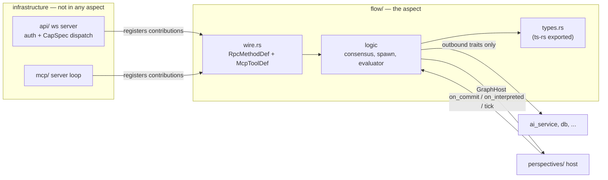

# Aspect holons — target structure, traits, and wire design

Date: 2026-09-04. Status: proposed (phase 2). Owner: core team.

This is the second phase of the rust-executor refactoring programme. Phase 1 is
`planning/rust-executor-refactoring-spec-2026-09-04.md` — the mechanical cleanup
— and it runs first and is worth doing regardless of this document. This
document describes what the cleaned-up crate is *for*: a target architecture in
which features like flows, interpretation, and the auto-processor are
**aspects** — holon-shaped modules hosted by a Perspective, each understandable,
testable, and extendable from inside its own boundary.

The name: these were called "aspects as plugins" in the PR discussion; "aspect
holons" names the goal more honestly. A holon is whole at its own level
(complete contract, own tests, own docs) and a part at the next level up (the
host dispatches to it, the wire layers aggregate it).

Questions this document answers, from the 2026-09-04 evening discussion:

1. What would the aspects be, and what is the target structure?
2. What is the aspect trait, concretely — and is it feasible?
3. Is the API service part of the aspect? Is WebSocket stuff inside aspects?
4. Some parts live client-side (TS) and some in the Rust backend — does an
   aspect span that boundary?

## 1. Three rings: what is an aspect, what is not

Not everything should become an aspect. The crate has three kinds of citizens:

| Ring | Contents | Shape |
|---|---|---|
| **Host** | `perspectives/`: links, diffs, sync, SDNA storage, shapes, `model_query`, `sparql_store`, `shacl` | The graph itself and its query/typing machinery. Always on. Aspects are built *out of* this. |
| **Aspects** | `flow/`, `interpretation/`, `auto_processor/` (first three); candidates later: notifications, telepresence, ordering (D2) | Optional per perspective, SDNA-activated, event-driven. Removing one leaves a working graph. |
| **Capability services** | `ai_service`, `db`, `prolog_service`, `holochain_service`, `languages`, `agent`, billing | Executor-wide infrastructure. Aspects reach them only through outbound traits. |

This answers the `Ad4mModel`/`ModelQuery` question directly: **`model_query` is
host, not aspect.** It is not optional, not SDNA-activated, and every aspect
depends on it — it is part of the vocabulary aspects are written in. It still
gets the same treatment at the *module* level (own directory, own `AGENTS.md`
contract, privacy-enforced boundary, spec item 8), but it is plugin-*shaped*
only in its documentation and encapsulation, not in its lifecycle. Making the
query engine unpluggable would be dishonest architecture: nothing works without
it.

The test for "is X an aspect": *could a perspective that never uses X pay zero
cost for it, and could a neighbourhood switch it on by sharing SDNA?* Flows: yes
(no `SHACLFlow` definitions → no spawn pass, no proposal pass). Interpretation:
yes (no auto-processor config and no interpret call → never runs).
`model_query`: no.

## 2. The traits

Two traits define the seam, plus per-capability outbound traits. They live in
`perspectives/host.rs` — traits only, no logic, so neither side depends on the
other's internals.

```rust
/// What the host offers an aspect. Deliberately narrower than
/// PerspectiveInstance: this is exactly the surface flow_evaluator and
/// flow_spawn use today (verified against the tree), and it grows only when
/// a second aspect demands a method. If GraphHost converges on the full
/// PerspectiveInstance surface, nothing was encapsulated — that is the
/// design's failure condition, and reviews should treat additions to this
/// trait with the same suspicion as additions to the pub API.
#[async_trait]
pub trait GraphHost: Send + Sync {
    fn uuid(&self) -> &str;
    fn did(&self) -> &str;
    async fn get_links(&self, q: &LinkQuery) -> Result<Vec<DecoratedLinkExpression>>;
    async fn add_links(&self, links: Vec<Link>, status: LinkStatus) -> Result<Vec<DecoratedLinkExpression>>;
    async fn remove_links(&self, links: Vec<DecoratedLinkExpression>) -> Result<()>;
    async fn model_query(&self, q: &ModelQuery) -> Result<serde_json::Value>;
    fn shapes(&self) -> Arc<ShapeResolver>;
}

/// What an aspect offers the host. Events are coarse — per committed diff,
/// per interpretation outcome, per tick — never per link, so the hot write
/// path pays one dynamic dispatch per registered-and-activated aspect, not
/// one per triple.
#[async_trait]
pub trait PerspectiveAspect: Send + Sync {
    fn name(&self) -> &'static str;

    /// SDNA activation: class/predicate URIs whose presence in the
    /// perspective's SDNA switches this aspect on. Empty = always on.
    fn activated_by(&self) -> &[&'static str];

    async fn on_commit(&self, host: &dyn GraphHost, diff: &CommittedDiff) -> Result<()>;
    async fn on_interpreted(&self, host: &dyn GraphHost, outcome: &InterpretationOutcome) -> Result<()>;
    async fn tick(&self, host: &dyn GraphHost) -> Result<()>;

    /// Wire contribution — see §3. Collected once at registration.
    fn wire(&self) -> WireContribution;
}
```

Outbound capability traits are per-need, defined by the aspect, implemented by
the service — the aspect never imports the service:

```rust
// flow/traits.rs — the aspect declares what it needs
#[async_trait]
pub trait SemanticCheck: Send + Sync {
    async fn check(&self, hint: &str, evidence: &str) -> Result<SemanticVerdict>;
}
```

**Feasibility — this is the part that is already proven, not speculative:**

- The `interpretation → flow` coupling is an *import, not a data dependency*:
  `interpretation/run.rs` calls `flow_evaluator::run_engine_proposal_pass`
  directly at the end of its pass. Replacing that call with
  `host.dispatch_interpreted(outcome)` changes no data flow. It also turns the
  #940 round-2 bug class (threading the wrong subject list across a module
  boundary) into a compile error, because the event type carries the scope.
- The mock seam already exists and carried this week's work: `CannedLlm` vs
  `AIServiceSemanticCheck` is precisely an outbound trait with a test
  implementation. `FlowStore` is just a name for link-shapes flow code already
  reads and writes.
- `flow_classes.rs` (hardwired flow SDNA) is already the activation key for
  flows; `activated_by()` makes the existing fact dispatch-relevant instead of
  incidental.

Sequencing of the registry: `Vec<Arc<dyn PerspectiveAspect>>` on
`PerspectiveInstance` until spec item 11 lands, then it moves to `AppContext`.
Aspects with mutual knowledge (see §6, auto_processor → interpretation) get it
through the other aspect's exported trait, never through its internals.

## 3. Wire surfaces: is the API service part of the aspect?

Split the question in two, because the current `api/` directory contains two
different things:

- **Transport** — the WebSocket server, connection lifecycle, auth,
  capability checking, JSON-RPC dispatch (`ws_rpc.rs`, `ws_handler.rs`,
  `auth.rs`), and equally the MCP server loop (`mcp/server.rs`). This is
  infrastructure. It is **not** part of any aspect and never moves.
- **Surface definitions** — *which* RPC methods exist, their parameter types,
  their capability requirements, their handler bodies; *which* MCP tools exist
  and their schemas. These are statements *about an aspect's contract* and they
  **belong to the aspect**.

The mechanism is the `WireContribution` an aspect returns at registration:

```rust
pub struct WireContribution {
    /// ("perspective.flowAccept", CapSpec::PerspectiveScoped(..), handler fn)
    pub rpc_methods: Vec<RpcMethodDef>,
    /// MCP tool definitions + handlers (the shape mcp/tools/flows.rs has today)
    pub mcp_tools: Vec<McpToolDef>,
    /// PubSub topics this aspect publishes (subscription surface)
    pub topics: Vec<&'static str>,
}
```

`api/` collects contributions into its `HandlerMap`; `mcp/` collects tool defs
into its tool list. Spec **item 6 (declarative handler registration with
`CapSpec`) is the enabling prerequisite**: once registration is data instead of
hand-written match arms, it makes no difference to the dispatcher whether the
data came from `perspectives_ws.rs` or from an aspect — which is why item 6
stays in phase 1 and why this phase costs little once it lands.

So, concretely: **WebSocket handler *bodies* for flow methods live in
`flow/wire.rs`. The WebSocket itself lives in `api/`.** Same for MCP. The
aspect defines its surface; the host owns the socket.

Tonight's #968 shows both the target and the gap in one diff. Its flow wire
slice touched:

| File | Status vs target |
|---|---|
| `mcp/tools/flows.rs` | ✅ already aspect-shaped: one file, owned by flows |
| `api/perspectives_ws.rs` | ❌ flow handlers added to a shared 2,400-line file |
| `core/src/perspectives/PerspectiveClient.ts` / `PerspectiveProxy.ts` | ❌ flow client methods added to shared client classes |
| `core/src/perspectives/FlowInstance.ts` | ❌ flow model parked in the perspectives client dir |

MCP already lives the pattern. The refactor extends it to the other two
surfaces.



## 4. The client side: does an aspect span Rust and TypeScript?

**Yes — as a contract and a naming discipline, not as shared code.** An aspect
is a vertical slice through four layers, and the layers are tied together by
code generation, not by convention alone:

| Layer | Where | Owned by the aspect? |
|---|---|---|
| Rust logic + wire handlers | `rust-executor/src/flow/` | yes |
| Wire types | `#[ts(export)]` on the aspect's `types.rs`, generated into `core/src/generated/api/` via `pnpm generate:api-types` | yes (the Rust side is the single source of truth) |
| TS client module | `core/src/flow/` — proxy methods, model classes (`FlowInstance.ts` moves here), client-side helpers | yes |
| English contract | `flow/AGENTS.md` (server) — its **Boundary section lists every path the aspect owns across all four layers**, including the TS ones | yes |

What makes this real rather than aspirational:

- **Codegen is the spanning mechanism.** The generated types in
  `core/src/generated/api/` are the aspect's wire contract compiled for the
  other side. CI fails if the generated directory is dirty after
  `generate:api-types` (spec §5.7), so Rust↔TS drift is mechanical to catch.
  (The `FireOutcome` hand-written TS interface in #968 is the current
  counterexample and already has a follow-up to switch to the generated type.)
- **The holon acceptance test extends across the boundary**: a PR adding a flow
  feature touches only paths listed in `flow/AGENTS.md`'s Boundary — on both
  sides of the wire. Touching a second aspect's files requires a stated reason
  in the PR description. This is checkable in review today and lintable later.
- **Facades stay, logic moves.** `PerspectiveProxy` keeps thin delegating
  methods (`proxy.flowAccept(...)` calling into `core/src/flow/`) so the
  public SDK surface stays stable per spec ground rule 6. The facade is
  allowed to be a table of contents; it is not allowed to contain aspect
  logic.

What an aspect does **not** span: the client bundle is not plugin-loaded. Both
sides compile the aspect in; SDNA activation (§5) decides at *runtime*, per
perspective, whether it does anything. Client-side dead code for an unused
aspect is a bundle-size concern, not a correctness concern, and tree-shaking
handles it if the module boundaries are clean — which is one more reason for
per-aspect TS modules instead of methods on a shared class.

## 5. SDNA activation — the AD4M-native half

A Language is code addressed by data: a language address in a perspective
handle activates it. An aspect is the same pattern internally: **code activated
by the presence of its social DNA in the graph.** The registry holds all
compiled-in aspects; before dispatching events, the host checks
`aspect.activated_by()` against the perspective's SDNA (cached, invalidated on
SDNA change — `inbound_touches_shacl` already exists for exactly this trigger).

What this buys:

- A perspective with no `SHACLFlow` definitions never runs a spawn pass, never
  pays flow's cost, never needs flow's invariants held in anyone's head.
- **Joining a neighbourhood whose SDNA declares flows wakes the flow aspect
  up.** Flows + ontologies become literally shareable social-DNA modules — the
  sentence from the flows vision doc, made mechanical.
- A horizon, deliberately out of scope this quarter: aspects behind a stable
  trait pair are the shape WASM plugins would need (cf. the Living Web specs'
  pluggable sync modules). Nothing in this document commits to that; nothing
  in it forecloses it.

## 6. Target structure

Server side (phase-2 end state; replaces the `agentic/` subtree of the phase-1
spec's §2 — see the edits noted there):

```
rust-executor/src
├── perspectives/                 HOST
│   ├── host.rs                   GraphHost + PerspectiveAspect + WireContribution (traits only)
│   ├── mod.rs registry, routing, perspective_instance/ (item 3), ...
│   ├── model_query/  sparql_store/  shacl/                 host capabilities (item 8)
├── flow/                         ASPECT
│   ├── mod.rs                    aspect impl: activation, event handlers, registration
│   ├── traits.rs                 outbound: FlowStore, SemanticCheck
│   ├── consensus.rs  spawn.rs  evaluator.rs  semantic_check.rs
│   ├── classes.rs                hardwired flow SDNA = activation key
│   ├── types.rs                  wire types, #[ts(export)]
│   ├── wire.rs                   RpcMethodDef + McpToolDef contributions
│   ├── e2e/                      #[cfg(feature = "llm-e2e")]
│   └── AGENTS.md                 contract; Boundary lists TS paths too
├── interpretation/               ASPECT (same internal shape)
├── auto_processor/               ASPECT (scheduler; drives interpretation via its exported trait)
├── ai_service/                   capability service; harness lives here or beside it —
│                                 EITHER WAY it implements aspect-defined traits and
│                                 imports no aspect internals (phase-1 item 7 steps 1–2, 5–6)
├── api/                          transport only: ws server, auth, CapSpec dispatch
├── mcp/                          transport only: server loop + non-aspect tools
└── db/  prolog_service/  holochain_service/  languages/  ...   services (items 4, 9, 10)
```

Client side, mirrored:

```
core/src
├── flow/                         FlowInstance.ts, flow client methods, tests
├── model/  perspectives/  ...    host-capability clients (Ad4mModel, ModelQuery stay here)
└── generated/api/                ts-rs output — the wire contract, never hand-edited
```

Inter-aspect dependencies, stated rather than hidden: `auto_processor` invokes
`interpretation` by name (it is a scheduler; that is its job) — allowed, but
only through `interpretation`'s exported trait, declared in both contracts.
`interpretation → flow` is *inverted* into the `on_interpreted` event, because
that direction is incidental (interpretation shouldn't know who listens).
Import edges beyond exported traits + `types.rs` are forbidden, and §1b of the
synthesis applies: **Rust visibility is the primary enforcement** (aspects
export the trait and `types.rs`, everything else private), the `#[cfg(test)]`
dependency test is the backstop for coarse edges privacy can't express.

Whether the three aspect directories get a common parent (`aspects/`) is
decision D6 — deferred until after the traits exist, at which point the move
is mechanical either way.

## 7. Sequencing: cleanup first, then aspects

Confirmed: **phase 1 (the mechanical spec) runs first and is worth it on its
own.** Phase 2 starts only when its gates are green — this is what keeps it
from becoming the same class of collision that big-bang moves invite.

**Phase-1 bridge items** (cheap now, in the revised week-1 slice): the two
outbound traits (`FlowStore`, `SemanticCheck`) named and used in place, no
directory moves; the contract-template `AGENTS.md` rewrite with cross-layer
Boundary lists; `scripts/lint-agent-docs`.

**Gates for starting phase 2:**

1. Spec item 6 landed (declarative registration — the `WireContribution`
   substrate).
2. Spec item 3 landed (the host is disentangled enough that `GraphHost` is a
   surface, not a hope).
3. The holon acceptance test ("flow PRs touch only flow files, or say why")
   has held in review for ~a month — evidence the boundaries are real before
   the directories claim they are.
4. Item 11 (`AppContext`) at least started, so the registry has a home to move
   to.

**Phase-2 steps, each its own PR, mechanical-move discipline throughout:**

1. `perspectives/host.rs`: traits + `CommittedDiff`/`InterpretationOutcome`
   event types. Registry as `Vec<Arc<dyn PerspectiveAspect>>` on the instance.
2. Flow becomes the first registered aspect: replace the `run.rs` direct call
   with `on_interpreted` dispatch; `auto_processor_loop` drives `tick`.
   Behaviour-identical; the e2e suites are the referee.
3. Wire contributions: flow's WS handlers move out of `perspectives_ws.rs`
   into `flow/wire.rs`; `mcp/tools/flows.rs` content likewise (it is already
   shaped for this).
4. Client mirror: `core/src/flow/` created; `FlowInstance.ts` and the proxy
   flow methods move; facades delegate.
5. `interpretation` and `auto_processor` follow the flow template.
6. SDNA activation check in the dispatch path (until here, aspects are
   always-on — activation is an optimization and a semantic, not a
   prerequisite).
7. Directory moves + D6 naming, last, when they are boring.

## 8. Open decisions

| # | Decision | Default until decided |
|---|---|---|
| D6 | Common parent dir (`aspects/`) vs top-level siblings | siblings, no parent |
| D8 | Types-only import edges (privacy-enforced) | adopt as stated in §6 |
| D9 | Does `notifications` (currently in `perspective_instance`) become the fourth aspect? It fits the test (optional, trigger-driven) | not this quarter; revisit after step 5 |
| D10 | Client-side: per-aspect npm subpath exports (`@coasys/ad4m/flow`) vs single bundle | single bundle; revisit with tree-shaking data |

## Relationship to other documents

- Phase 1: `planning/rust-executor-refactoring-spec-2026-09-04.md` (the
  mechanical programme; its item 7 cycle-break steps 1–2/5–6 stand, its
  `agentic/` directory move is superseded by §6 here).
- Review synthesis that produced this design: PR #970 discussion (three-pass
  review, 2026-09-04) — Marvin: host/aspects inversion, holon test on flows;
  Lal: contract template, tense rule; Data: SDNA activation, privacy
  enforcement, wire/client spanning (§3–§4 here).
- Flows vision: `memory` planning docs on flow interpretation hints — the
  "shareable social DNA modules" sentence §5 operationalizes.
