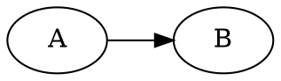
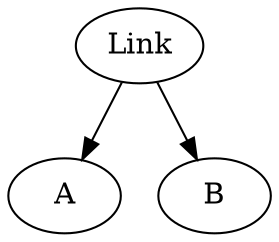

# ACAI
*Agent-Centric Application Interface*

An agent-centric, storage-agnostic, link-based **interface definition for a new and decentralized web** that carves out the quintessence that lies in the intersection of Holochain, IPFS, blockchain networks, ActivityPub, the Semantic Web and even the centralized Web 2.0, in order to create an interoparability layer between all of these and invite an ecosystem of **interoparable micro-service modules of Languages** as a counter-culture against monolithic apps, data silos and ecosystem-wars.

Beyond **Agent** and **Language**, it introduces **Perspective** as a third fundamental onotological entity which completes the two former by allowing the explicit representation of associations between Expressions of various Languages as projected by an Agent - and thus: Context.

## Agent
Agents are uniquely identified using DID (Decentralized Identifier)
https://www.w3.org/TR/did-core/#did-resolution
```typescript=
class Agent {
    did: string;

    constructor(did: string) {
        this.did = did
    }
}
```

(TODO: keyhandling, signing of sub-keys that are used in Languages below)

## Language
Language is the term and abstract interface for all data-integrity plugins/back-ends.
It can represent a Holochain DNA, a centralized server, some blockchain adapter or an ActivityPub interface.

It assembles several sub-aspects into one coherent - well - language:
1. The back-end storage adapter implementation (the code that talks to Holochain or ActivityPub, see **ExpressionAdapter** below)
2. User interface components (called **Icons**) based on the web component standard (https://www.webcomponents.org/) for rendering and interacting with expressions 
3. Available (= possible and allowed) **Interactions**

```typescript=
interface Language {
    // Unique identifier of language (in case of Holochain DNA = DNA hash)
    readonly hash: string;
    
    // Adapter implementation:
    readonly expressionAdapter: ExpressionAdapter;
    
    // UI factories returning web components:
    iconFor(expression: Address): string; // returns JS code that implements this Language's web component
    constructorIcon(): string;
    
    // All available interactions agent 'a' could execute on given expression
    interactions(a: Agent, expression: Adress): Interaction[];
}
```

It is up to the Language implementation to define and implement the Interactions available to an agent for a given expression.

### Interactions (interfacing UI)
Interactions are expected to implement the following interface:

```typescript=
interface Interaction {
    readonly label: string;
    readonly name: string;
    readonly parameters: [string, string][];
    execute(parameters: object);
}
```

Icons - which are [web components](https://www.webcomponents.org/) - can and should expect to get an array of above *Interaction* objects injected via HTML property by the runtime.

### ExpressionAdapter (interfacing storage back-end)
No matter which technological solution was applied for the sharing of data and ensuring its integrity, looking at it from an agent-centric viewpoint, we can assume that it provides means to create expressions (pieces of data created by an agent) and retrieve them.

For the latter, retrieving, we promote the concept of **content addressing** (used in IPFS/IPLD, Holochain and others) from a low-level storage implementation detail to an essential semantic of the interface: within the scope of a Language, an expression is uniqely identifiable and retrievable by its address (in most cases: hash).

Additionaly, still following the agent-centric premise which implies that every expression originates from an authoring agent, we can retrieve expressions by author as well (`get_by_author()`).

Within the scope of one storage back-end, expressions are shared publicly - that is with every other agent being able to pass the membrane, join the DHT, sign-in to a server, etc. In orde to send private expressions, we need to introduce `send_private()` and the `inbox()`.

```typescript=
interface Address {
    toString(): string;
}

interface ExpressionAdapter {
    create_public_expression(content: object): Promise<Address>;
    get_expression_by_address(address: Address): Promise<void | Expression>;

    /// Get expressions authored by a given Agent/Identity
    get_by_author(author: Agent, count: number, page: number): Promise<void | Expression>;

    /// Send an expression to someone privately p2p
    send_private(to: Agent, content: object);
    /// Get private expressions sent to you
    inbox(): Promise<Expression[]>;
}
```

## GIDL: Global, inter-dimensional links
*(...because inter-planetary doesn't cut it ;)*

The main rationale for an abstract interface that harmonizes all existing data-storage/-integrity solutions as agent-centric languages as described above is the introduction of a platform (as in *"level of abstraction"*) that can relate (that is, create links between) expressions that live inside different storage solutions (different Holochain apps, and IPFS object, an Ethereum transaction).

There is as huge overlap with [IPLD](https://ipld.io/) and maybe it is possible and wise to marry it with the concepts described below. The reason for not integrating it (yet?) is that, here the focus lies on *externally* (as seen from the expression language implementation) adding links between expression that might have never been implemented with such a link being anticipated. 

So, we are not interested in these kinds of links (where A and B are expressions of different Languages LangA and LangB):

IPLD would enable this kind of link between different Languages without coupling LangA to LangB (too much). 

But this solution would imply that the link is a property of expression A - something that ontologically belongs to the expression. For reasons explained below, we think that is a bad choice. So the assumption baked into the following interfaces is that links are like edges in a graph that mention the nodes (expressions) they link:


### Expression URLs

Links, as described above, point to two expressions. How do you point to an expression, globally? With a URL:
```
Qm58dh238794ydsf://Qmdhw3uir4hdsrukithk
```
that is
```
<language address>://<expression address>
```
With the TypeScript types:

```typescript=
type Hash = Address;

// Unique Language ID with option type
class LanguageRef {
    address: Address;
    name: string;
}

// Expression address + unique Language ID = global expression URL
class ExpressionRef {
    language: LanguageRef;
    expression: Address;
}

```

So we just let the Language's address/hash become a URL schema. With aliases like 'https' that are pointing to a hash of an installed Language (overwritable per perspective) we can include all existing URLs as expressions.

### Links
Now we can just combine two expression URLs to a link, like a graph edge:

```typescript=
class Link {
    source: ExpressionRef;
    target: ExpressionRef;
    predicate?: ExpressionRef;
}
```
Oh wait, there is a third reference, `predicate`!
For the purposes expanded on below, it is not sufficient to just connect two expressions without further information or context - in almost every case we need to know how and/or why two expressions are connected. What is the kind of their relationship.

This raises the question, how to represent these different kind of links. Also, you might recongnize the resemblance of this with RDF triples - and their subject/predicate/object notion.

Well, we already defined Languages in an abstract way. So why not use this abstraction here and imply that a link-predicate is an Expression of a (elsewhere) defined Language. As a result, we could define a link language through the introduction of a Holochain DNA - but we could also translate an old W3C ontology like [FOAF](http://xmlns.com/foaf/spec/) into a Language as well (which would just be a static language with a purely locally acting ExpressionAdapter that only operates on a static list of expressions).

## Perspectives
The single-most important insight fueling this approach is this:
```
Agent + Links (between abstract Expressions of arbitrary Languages) = Perspective
```
... and *Perspective* means *context*.
Each agent can (and each human does) have their own associations between the expressions they perceive. (In the case of humans, *"have"* means *"assume"*.)


**Everything above are the building-blocks for the following and central concept of *Perspectives*.**

### Set of links (graphs) as UX context (=perspective)
With the already defined `class Link` we can introduce an interface for link repositories (or graphs):
```typescript=
interface LinkRepository {
    getRootLinks(): Link[];
    addRootLink(link: Link);
    getLinksFrom(source: ExpressionRef): Link[];
    getLinksTo(target: ExpressionRef): Link[];
    addLink(link: Link)
    removeLink(link: Link)
} 
```

With an implementation of these, we can imagine a general user interface that uses links to pull-in expressions of arbitrary languages and render each with its Icon (as provided by the Language) into one window. Of course, there can be many different specific use-cases that imply different visualization, filtering and linking specifics. But all we need to populate any potential UI is an expression graph that can be traversed via links (with at least one root/anchor expression to enter the graph).

*This is the fundamental difference to monolithic app architectures where data-storage and integrity is tightly coupled to use-cases and UI logic.*

With LinkRepositories, users, agents can compose UX contexts freely and cater them to their needs by combining and relating expressions across different Languages.

Any graph of expressions, that is, a set of specific, chosen relationships over expressions as an implementation of a LinkRepository *is the embodiement of an agent's **perspective** onto the space of all expressions*.

```typescript=
interface Perspective {
    localGraph: LinkRepository;
} 
```

We could stop here and already have the basis to build powerful tools for personal organization and mapping of relationships of data/apps/expressions (interactive mind maps, rich to-do lists, unified inboxes, etc.). It is the level of complexity up onto which the Semantic Web's modelling stretches. But in order to fully replicate the power and coherence of monolithic social-, collaboration- and sharing (web) apps, we need just one more thing:

### Shared Perspectives / Social Contexts
*...that is, a language of perspectives.*

*TODO: still very rough - anything below needs refinement.*
    * *Can LinkAdapters be just regular Languages with special interactions?*
    * *Can SharedPerspectives also be formulated as Language?*

The ability to compose an interaction context, a perspective, for a specific use-case is great. But if we couldn't share the coherence it creates with other agents, it wasn't suitable for social and collaboration apps.

Well, the link repository can be implemented using a decentralized storage back-end in the same way expressions get stored in decentralized networks. Let's introduce an interface for link storage adapters:

```typescript=
interface LinkAdapter {
    writable(): bool;
    public(): bool;
    others(): Agent[];
    
    downloadLinks(query: LinkQuery): LinkMeta[];
    downloadAllLinks(): LinkMeta[];
    publishLinks(LinkMeta[]);
    
    //Get push notified by added links
    addCallback((newRemoteLinks: LinkMeta[]):void);
}
```

In the context of shared Perspectives, links get created by different agents. So `LinkMeta` is a wrapper around `Link` that provides information about when and by whom a link got created. This enables Perspectives to compare and visualize the provenance of parts of the shared graph.

```typescript=
class LinkMeta {
    link: Link;
    author: Agent;
    created_at: DateTime;
}
```


```typescript=
class SharedPerspective {
    
}
```
